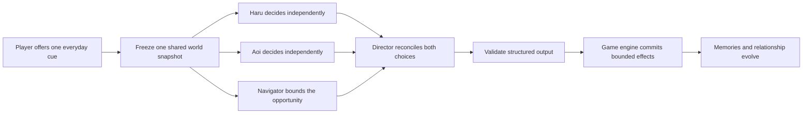
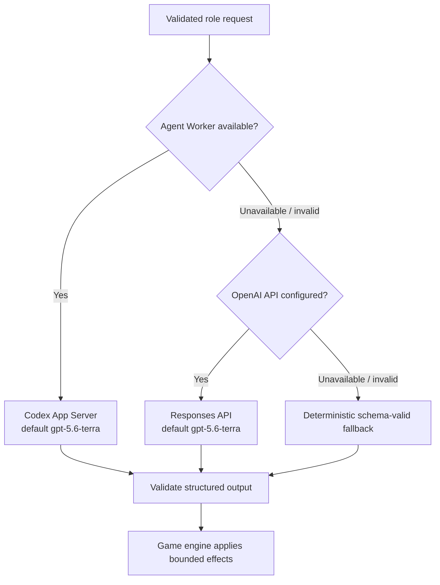

# ROOMMATES

> **You do not make them fall in love. You create the place where love might begin.**

**OpenAI Build Week · Apps for Your Life**

ROOMMATES is a seven-day autonomous relationship simulation. The player offers
everyday cues, while Haru and Aoi independently decide what to do from the same
frozen world state. A Director agent reconciles both intentions into one validated
event—so refusal, modification, and non-romantic endings remain meaningful outcomes.

[](https://roommates-build-week-guide.donald-25.chatgpt.site)

## Start here

| Goal | Link |
| --- | --- |
| Play the working project | [Live game — no login required](https://roommates-heart-game.donald-25.chatgpt.site) |
| Understand it visually | [Bilingual visual field guide](https://roommates-build-week-guide.donald-25.chatgpt.site) |
| Review the submission narrative | [English Build Week submission pack](./docs/openai-build-week-submission.md) |
| Inspect the implementation | [Architecture and technical documentation](#technical-reference) |

## Judge it in 90 seconds

1. Open the [live game](https://roommates-heart-game.donald-25.chatgpt.site) and
   reset it if a session is already in progress.
2. Optionally open **Character Studio** and change one personality trait.
3. Enter: **“How about cooking dinner together?”**
4. Watch Navigator, Haru, and Aoi begin from the same state. Haru and Aoi decide
   independently; neither sees the other's answer first. Then read the Director's
   resolved event and inspect the per-role runtime attribution.
5. Use **Fast Forward** to reach Day 7, then review the recap, both character
   reflections, and the evidence behind the in-game Producer Score.

The UI is Japanese-first. The
[visual field guide](https://roommates-build-week-guide.donald-25.chatgpt.site)
provides a bilingual explanation of the full experience and architecture.

## Why it matters

Traditional relationship games often make player choices directly determine how
another character feels or behaves. That turns the character into an interface
to optimize.

ROOMMATES separates **influence** from **control**:

| Typical relationship game | ROOMMATES |
| --- | --- |
| Choose the “correct” response | Offer an everyday cue |
| The choice changes the character | Each resident interprets it independently |
| The desired route is the success state | Acceptance, modification, refusal, or distance can all be valid |
| Affection unlocks romance | A relationship changes only when both characters' intentions align |

The player's role is to create conditions for connection—not to force an outcome.

## What to look for

| Build Week judging lens | Evidence in ROOMMATES |
| --- | --- |
| Technical implementation | Isolated resident decisions, schema-validated multi-agent orchestration, one state writer, per-role fallback, SSE, and 370 automated tests |
| Design | A map-first 2LDK home, Character Studio, visible agent progress, responsive controls, and an explainable Day 7 result |
| Impact | Makes AI agency understandable through an everyday experience where rejection and uncertainty are valid—not errors |
| Quality of the idea | Reframes relationship simulation around mutual intent instead of optimizing affection or selecting a scripted route |

## How one turn works



Haru and Aoi may **accept, modify, decline, ignore, or initiate a different
action**. A rejected suggestion is evidence of character agency, not a broken turn.

## Meaningful GPT-5.6 integration

The checked-in default model for both hosted real-provider paths is
`gpt-5.6-terra`.

| Role | What the model contributes |
| --- | --- |
| Navigator | Interprets a free-form cue as safe, bounded event guidance |
| Haru | Decides through Haru's profile, needs, memories, and personality |
| Aoi | Independently interprets the same situation through Aoi's perspective |
| Director | Reconciles two intentions into one coherent, schema-valid event |
| Reflections | Comments on the saved seven-day history without changing it |

GPT-5.6 does **not** directly mutate game state. Every response must match a
role-specific schema; deterministic code owns the committed result.

### Production evidence

On July 20, 2026 at 12:00 JST, an isolated anonymous production test completed
one turn from revision 0 to 1 in approximately 11.2 seconds. Navigator, Haru,
Aoi, and Director all reported `openai_api`.

Provider attribution proves that the public turn used the real OpenAI path, but
does not reveal the model name. The repository defaults to `gpt-5.6-terra`;
deployment configuration can override it and must be verified separately.

## How Codex accelerated development

Codex collaborated across the build loop with reviewable GitHub evidence:

- translated the premise into state, role, event, and safety contracts, then
  helped build the map-first MVP in [PR #27](https://github.com/aieo-product/teamOtaniHackathon/pull/27);
- implemented and tested the seven-day recap and explainable in-game score in
  [PR #36](https://github.com/aieo-product/teamOtaniHackathon/pull/36);
- helped turn autonomous decisions into coherent multi-beat scenes in
  [PR #49](https://github.com/aieo-product/teamOtaniHackathon/pull/49);
- hardened the hosted Agent Worker, direct Responses API path, privacy boundaries,
  and Cloudflare runtime in [PR #47](https://github.com/aieo-product/teamOtaniHackathon/pull/47),
  [PR #54](https://github.com/aieo-product/teamOtaniHackathon/pull/54), and
  [PR #56](https://github.com/aieo-product/teamOtaniHackathon/pull/56);
- expanded unit, contract, API, D1, provider, and UI verification to 370 tests.

The human team retained the defining product decisions:

- the player may influence, but never directly control;
- both residents must decide independently;
- mutual intent is required for a relationship change;
- generated output cannot directly mutate state;
- a reliable, visible fallback is better than a broken experience.

## The seven-day experience

- a map-first 2LDK home where the current place and activity remain visible;
- four phases per day across a complete seven-day arc;
- editable profiles and ten personality traits in Character Studio;
- energy, stress, trust, affection, memories, and relationship state;
- autonomous everyday scenes that can continue beyond the player's suggestion;
- a Day 7 recap, read-only character reflections, and explainable Producer Score;
- responsive controls for desktop and 390–430px smartphone layouts;
- per-role provider attribution for `app_server`, `openai_api`, `mock`, or
  `fallback`.

## Reliability and safety boundaries



- Player text is isolated as untrusted game data, not treated as a system command.
- Only the game engine mutates state.
- Generated outputs are schema-validated and numeric effects are clamped to 0–100.
- Revision checks, state locking, and idempotency prevent duplicate turns.
- The direct OpenAI path uses `store: false`, exposes no tools, and keeps secrets
  server-side.
- Chain of thought and internal summaries are not shown or persisted.
- Failure is isolated per role; the rest of the turn can continue.
- The fallback follows the same contracts and reacts to input and state. It is not
  a prerecorded video path.

## Architecture

| Workspace | Responsibility |
| --- | --- |
| `apps/web` | React/Vite map-first game UI, Character Studio, runtime status, Day 7 result |
| `apps/server` | Express API, Cloudflare Worker, SSE, game engine, provider adapters, persistence |
| `packages/shared` | Game state, agent I/O, public DTOs, SSE events, and Zod schemas |

The game engine is the only state writer. Every manual turn gives Navigator,
Haru, and Aoi the same validated snapshot; the Director runs only after both
resident decisions are available.

## Run locally

### Requirements

- Node.js 20 or newer
- npm
- Codex CLI only when testing local App Server execution
- an OpenAI Project API key only when testing the direct Responses API path

### Install and start

```bash
npm install
npm run dev
```

Open:

- UI: <http://localhost:5173>
- API: <http://localhost:3001>
- health: <http://localhost:3001/api/health>

### Deterministic offline mode

```bash
AGENT_MODE=mock npm run dev
```

### Real-provider mode

```bash
AGENT_MODE=auto CODEX_BIN=codex npm run dev
```

See [`.env.example`](./.env.example) for all optional provider, timeout,
rate-limit, and deployment settings. Never commit credentials.

## Verification

Validated on July 20, 2026:

| Check | Result |
| --- | --- |
| TypeScript | ✅ |
| Server tests | ✅ 350 passed |
| Web tests | ✅ 20 passed |
| Production build | ✅ |
| Cloudflare Worker and Sites package | ✅ |
| Production dependency audit | ✅ 0 vulnerabilities |
| Public game HTTP response | ✅ 200 |
| Anonymous real-provider turn | ✅ 4 roles reported `openai_api` |

```bash
npm run check
npm run check:sites
```

CI runs the complete repository check on pull requests and `main`.

## Built during Build Week

Implementation in this repository began on **July 18, 2026**, after the submission
period opened. The repository history documents the Build Week work:

| Date | Evidence | Outcome |
| --- | --- | --- |
| Jul 18 | [Initial commit](https://github.com/aieo-product/teamOtaniHackathon/commit/13e16e6), [PR #27](https://github.com/aieo-product/teamOtaniHackathon/pull/27) | Repository, visual specifications, sprites, and playable map-first MVP |
| Jul 18 | [PR #32](https://github.com/aieo-product/teamOtaniHackathon/pull/32) | Character Studio and personality-aware decisions |
| Jul 18 | [PR #36](https://github.com/aieo-product/teamOtaniHackathon/pull/36) | Seven-day recap, reflections, Producer Score, and Sites runtime |
| Jul 18–19 | [PR #46](https://github.com/aieo-product/teamOtaniHackathon/pull/46), [#49](https://github.com/aieo-product/teamOtaniHackathon/pull/49) | Autonomous room scenes and multi-beat event composition |
| Jul 18–19 | [PR #47](https://github.com/aieo-product/teamOtaniHackathon/pull/47), [#54](https://github.com/aieo-product/teamOtaniHackathon/pull/54) | Authenticated Agent Worker and Responses API fallback |
| Jul 19 | [PR #51](https://github.com/aieo-product/teamOtaniHackathon/pull/51), [#53](https://github.com/aieo-product/teamOtaniHackathon/pull/53) | Smartphone controls and map focus mode |
| Jul 20 | [PR #55](https://github.com/aieo-product/teamOtaniHackathon/pull/55), [#56](https://github.com/aieo-product/teamOtaniHackathon/pull/56) | Safe runtime diagnostics and Cloudflare fetch fix |

## Technical reference

- [2LDK layout and game-view specification](./docs/room-layout.md)
- [Character sprites](./docs/character-sprites.md)
- [Furniture and everyday object assets](./docs/furniture-assets.md)
- [Autonomous event composition](./docs/autonomous-event-composition.md)
- [Day 7 result experience](./docs/result-experience.md)
- [Producer Score v1](./docs/result-scoring-v1.md)
- [GameState v2 and privacy boundary](./docs/game-state-v2.md)
- [Fast-skip design](./docs/fast-skip.md)
- [OpenAI Build Week submission pack](./docs/openai-build-week-submission.md)

## Known limitations

- The public build is hackathon-scale and has no authentication, cloud save slots,
  ranking, or multiplayer.
- The UI is Japanese-first; the submission video needs English narration or a
  complete English translation.
- Character movement uses event/room anchors rather than free pathfinding.
- The current synchronous Fast Forward works. The designed background job,
  cancellation, and restart-recovery flow in Issue #33 is not implemented.
- Generated output varies by run, and an individual role may fall back after a
  timeout or invalid response.
- The public endpoint reports provider attribution but intentionally does not
  expose the configured model name.

<details>
<summary><strong>日本語での短い説明</strong></summary>

ROOMMATESは、プレイヤーがHaruとAoiを直接操作せず、日常の「きっかけ」だけを
提案する7日間の自律型リレーションシップ・シミュレーションです。二人は同じ世界状態を
見ながら独立して判断し、Directorが両者の意思を尊重して一つの出来事へまとめます。

まずは[非エンジニア向けビジュアル設計ガイド](https://roommates-build-week-guide.donald-25.chatgpt.site)
をご覧ください。

</details>
