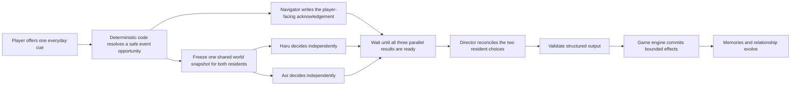
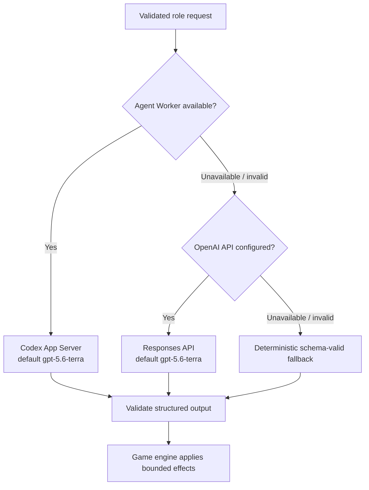

# ROOMMATES

> **You do not make them fall in love. You create the place where love might begin.**

**OpenAI Build Week · Apps for Your Life**

ROOMMATES is a seven-day autonomous relationship simulation. The player offers
everyday cues, while Haru and Aoi independently decide what to do from the same
frozen world state. A Director agent reconciles both intentions into one validated
event—so refusal, modification, and non-romantic endings remain meaningful outcomes.

[](https://roommates-build-week-guide.donald-25.chatgpt.site)

Haru and Aoi are the included sample characters. Their names, profiles,
personalities, sprite sheets, and furniture placements can be replaced through
the live editors and validated asset contracts. Roommates Asset Format v1 also
defines a portable room-pack contract; loading arbitrary room packs at runtime is
the next platform step.

## Start here

| Goal | Link |
| --- | --- |
| Play the working project | [Live game — no login required](https://roommates-heart-game.donald-25.chatgpt.site) |
| Understand it visually | [Bilingual visual field guide](https://roommates-build-week-guide.donald-25.chatgpt.site) |
| Review the submission narrative | [English Build Week submission pack](./docs/openai-build-week-submission.md) |
| Inspect the implementation | [Architecture and technical documentation](#technical-reference) |

## Judge it in 90 seconds

1. Open the [live game](https://roommates-heart-game.donald-25.chatgpt.site) and
   reset it if a session is already in progress.
2. Optionally open **Character Studio** and change one personality trait.
3. Enter: **“How about cooking dinner together?”**
4. Watch Navigator, Haru, and Aoi start concurrently for the same turn. Haru and
   Aoi receive the identical frozen world snapshot and decide independently;
   neither sees the other's answer first. The Director begins after all three
   finish. Read the resolved event and inspect the per-role runtime attribution.
5. Open the latest event and compare each resident's choice, dialogue, and the
   Director's resolved scene.

For a longer 3–5 minute path, advance once to see the animated phase transition,
then use **Fast Forward** until Day 7 and review the recap, both character
reflections, and the evidence behind the in-game Dekopin Support Score.

The UI is Japanese-first. The
[visual field guide](https://roommates-build-week-guide.donald-25.chatgpt.site)
provides a bilingual explanation of the full experience and architecture.

## Why it matters

Traditional relationship games often make player choices directly determine how
another character feels or behaves. That turns the character into an interface
to optimize.

ROOMMATES separates **influence** from **control**:

| Typical relationship game | ROOMMATES |
| --- | --- |
| Choose the “correct” response | Offer an everyday cue |
| The choice changes the character | Each resident interprets it independently |
| The desired route is the success state | Acceptance, modification, refusal, or distance can all be valid |
| Affection unlocks romance | Becoming a couple requires an eligible confession event and two cooperative decisions |

The player's role is to create conditions for connection—not to force an outcome.

## What to look for

| Build Week judging lens | Evidence in ROOMMATES |
| --- | --- |
| Technical implementation | Isolated resident decisions, schema-validated multi-agent orchestration, one state writer, per-role fallback, SSE, and 617 automated tests |
| Design | A map-first 2LDK home, Character Studio, visible agent progress, responsive controls, and an explainable Day 7 result |
| Impact | Makes AI agency understandable through an everyday experience where rejection and uncertainty are valid—not errors |
| Quality of the idea | Reframes relationship simulation around mutual intent instead of optimizing affection or selecting a scripted route |

## How one turn works



Haru and Aoi may **accept, modify, decline, ignore, or initiate a different
action**. A rejected suggestion is evidence of character agency, not a broken turn.

## Meaningful GPT-5.6 integration

The checked-in default model for both hosted real-provider paths is
`gpt-5.6-terra`.

| Role | What the model contributes |
| --- | --- |
| Navigator | Writes a friendly acknowledgement of the already resolved, bounded opportunity |
| Haru | Decides through Haru's profile, needs, memories, and personality |
| Aoi | Independently interprets the same situation through Aoi's perspective |
| Director | Reconciles two intentions into one coherent, schema-valid event |
| Reflections | Comments on the saved seven-day history without changing it |

GPT-5.6 does **not** directly mutate game state. Every response must match a
role-specific schema; deterministic code owns the committed result.

### Production evidence

On July 20, 2026 at 12:00 JST, an isolated anonymous production test completed
one turn from revision 0 to 1 in approximately 11.2 seconds. Navigator, Haru,
Aoi, and Director all reported `openai_api`.

Provider attribution proves that the public turn used the real OpenAI path, but
does not reveal the model name. The repository defaults to `gpt-5.6-terra`;
deployment configuration can override it and must be verified separately.

On July 21, the production Sites configuration was checked again: the OpenAI
Project API key is registered as a server-side secret, no `OPENAI_API_MODEL`
override is present, and `/api/health` reports `openaiApiConfigured: true`.
The deployed Worker therefore uses the checked-in `gpt-5.6-terra` default for
the direct Responses API path.

## How Codex accelerated development

Codex collaborated across the build loop with reviewable GitHub evidence:

- translated the premise into state, role, event, and safety contracts, then
  helped build the map-first MVP in [PR #27](https://github.com/aieo-product/teamOtaniHackathon/pull/27);
- implemented and tested the seven-day recap and explainable in-game score in
  [PR #36](https://github.com/aieo-product/teamOtaniHackathon/pull/36);
- helped turn autonomous decisions into coherent multi-beat scenes in
  [PR #49](https://github.com/aieo-product/teamOtaniHackathon/pull/49);
- hardened the hosted Agent Worker, direct Responses API path, privacy boundaries,
  and Cloudflare runtime in [PR #47](https://github.com/aieo-product/teamOtaniHackathon/pull/47),
  [PR #54](https://github.com/aieo-product/teamOtaniHackathon/pull/54), and
  [PR #56](https://github.com/aieo-product/teamOtaniHackathon/pull/56);
- expanded unit, contract, API, D1, provider, asset, and UI verification to 617 tests.

The human team retained the defining product decisions:

- the player may influence, but never directly control;
- both residents must decide independently;
- becoming a couple requires an eligible confession event and two cooperative decisions;
- generated output cannot directly mutate state;
- a reliable, visible fallback is better than a broken experience.

## The seven-day experience

- a map-first 2LDK home where the current place and activity remain visible;
- four phases per day across a complete seven-day arc;
- editable profiles and ten personality traits in Character Studio;
- energy, stress, trust, affection, memories, and relationship state;
- autonomous everyday scenes that can continue beyond the player's suggestion;
- a Day 7 recap, read-only character reflections, and explainable Dekopin Support Score;
- responsive controls for desktop and 390–430px smartphone layouts;
- per-role provider attribution for `app_server`, `openai_api`, `mock`, or
  `fallback`.
- an Asset Manager for tile footprints, pivots, room placement, sprite sheets,
  and `roommates.project` JSON import/export;
- a validated Roommates Asset Format v1 with schemas, sample character,
  furniture, and room packs, plus a manifest validator;
- animated time-passage eye-catches for manual phase advances, plus
  furniture-aware starting positions for every phase.

## Reliability and safety boundaries



- Player text is isolated as untrusted game data, not treated as a system command.
- Only the game engine mutates state.
- Generated outputs are schema-validated and numeric effects are clamped to 0–100.
- Revision checks, state locking, and idempotency prevent duplicate turns.
- The direct OpenAI path uses `store: false`, exposes no tools, and keeps secrets
  server-side.
- Chain of thought and internal summaries are not shown or persisted.
- Failure is isolated per role; the rest of the turn can continue.
- The fallback follows the same contracts and reacts to input and state. It is not
  a prerecorded video path.

## Architecture

| Workspace | Responsibility |
| --- | --- |
| `apps/web` | React/Vite map-first game UI, Character Studio, runtime status, Day 7 result |
| `apps/server` | Express API, Cloudflare Worker, SSE, game engine, provider adapters, persistence |
| `packages/shared` | Game state, agent I/O, public DTOs, SSE events, and Zod schemas |

The game engine is the only state writer. Every manual turn starts Navigator,
Haru, and Aoi concurrently. Haru and Aoi receive the same validated world snapshot;
Navigator receives the already resolved event opportunity. The Director runs only
after all three results are available and reconciles the two resident decisions.

## Run locally

### Requirements

<details>
<summary>Advanced Agent Worker and hosted fallback notes (Japanese)</summary>

各ゲームセッションと男性キャラ／女性キャラ／デコピン／Director／振り返りごとにApp Server threadを分離し、ゲームのリセット時には会話世代も切り替えます。各ターンでは、解決済みイベント機会を受け取るデコピンと、同一の固定World Snapshotを受け取る二人のキャラクターを並列に開始し、3役すべての推論が揃ってからDirectorが二人の判断をイベントへ統合します。使われていない会話scopeは30分TTL・最大64scopeのLRUで削除します。Agent Workerのモデルは既定で`gpt-5.6-terra`、デコピン／キャラクターの推論強度は`low`、Director／振り返りは`medium`です。この指定はAgent Worker内だけに適用され、普段のCodex設定は変更しません。Agent WorkerのBearer token、プレイヤー入力、モデル出力はログへ出しません。App Serverは既定で空の一時ディレクトリと最小限の環境変数から起動し、shell・web検索・MCPなどの外部ツールを無効にします。同時推論数は8、実推論開始数は既定60回/分に制限します。

ローカルでAgent Workerを起動する例:

```bash
AGENT_WORKER_TOKEN=local-development-secret npm run dev:agent-worker
```

別ターミナルでゲーム全体を同じ経路へ接続します。

```bash
AGENT_MODE=auto \
AGENT_WORKER_URL=http://127.0.0.1:3002 \
AGENT_WORKER_TOKEN=local-development-secret \
AGENT_WORKER_TIMEOUT_MS=60000 \
npm run dev
```

`GET http://127.0.0.1:3002/health`も同じBearer tokenが必要です。本番ではAgent Workerを永続的なNode.js/コンテナ環境で動かし、公開Sites側の`AGENT_WORKER_URL`、secretの`AGENT_WORKER_TOKEN`、必要に応じて`AGENT_WORKER_TIMEOUT_MS`を設定します。非loopback URLにはtokenとHTTPSが必須で、平文HTTPはローカル開発だけ許可されます。App ServerのWebSocket transportは使わず、安定版のstdioをAgent Worker内に閉じ込めます。

本番接続の手順は次のとおりです。

1. 永続的なNode.js/コンテナ環境で`npm run build`後に`NODE_ENV=production npm run start:agent-worker`を起動し、十分に長い`AGENT_WORKER_TOKEN`をsecretとして設定します。
2. Agent Workerの前段でTLSを終端し、外部へ公開するのはHTTPSの`/health`と`/v1/invoke`だけにします。
3. Bearer token付き`GET /health`が200を返すことを確認します。
4. 既存Sitesプロジェクトへ`AGENT_WORKER_URL`を通常の環境変数、同じ`AGENT_WORKER_TOKEN`をsecretとして設定し、Sites版を再デプロイします。

Agent WorkerとOpenAI APIの両方が未設定なら、公開版は意図どおりモックだけで動作します。

### 公開版のOpenAI APIフォールバック

既存SitesプロジェクトのSecretへ`OPENAI_API_KEY`を登録すると、Agent Workerを利用できない役割だけOpenAI Responses APIで実行します。キーはデータ共有を有効にしたAPIプロジェクトで発行し、通常の環境変数やフロントエンドの`VITE_*`、Git管理へ置かないでください。`/api/health`とブラウザへ公開するのは`openaiApiConfigured`という真偽値だけで、キー自体は返しません。

OpenAI API利用時は、プレイヤーが入力した指示と生成内容が、選択したAPIプロジェクトのデータ共有設定に従ってOpenAIと共有される場合があります。ゲーム画面も、APIフォールバックが設定済みの場合は送信欄の前にこの案内を表示します。直接API経路は`store: false`かつツール呼び出しなしで、各役割の構造化出力だけを生成して検証します。

Complimentary daily tokensはアプリが保証する無料枠ではありません。選択したAPIプロジェクトがその特典へ登録済みで、対象モデル・共有対象トラフィックであり、アカウント残高がプラスの場合にだけ自動適用されます。日次枠を超えたリクエストは通常料金で請求されるため、利用状況とCostsをOpenAI Platformで確認してください。対象条件と上限は[OpenAI公式のデータ共有・complimentary tokens案内](https://help.openai.com/en/articles/10306912-sharing-feedback-evaluation-and-fine-tuning-data-and-api-inputs-and-outputs-with-openai)を正本とします。

現行の高速進行は同期APIで、各未プレイフェーズも通常ターンと同じ住人・Directorの契約を通ります。高速進行中のデコピン応答だけは決定論的モックです。job化、cancel、再起動復旧を含む将来設計は[高速スキップ設計 v1](./docs/fast-skip.md)を参照してください。

</details>

- Node.js 20 or newer
- npm
- Codex CLI only when testing local App Server execution
- an OpenAI Project API key only when testing the direct Responses API path

### Install and start

```bash
npm install
npm run dev
```

Open:

- UI: <http://localhost:5173>
- API: <http://localhost:3001>
- health: <http://localhost:3001/api/health>

<details>
<summary>Detailed local configuration and environment variables (Japanese)</summary>

ルートの`npm run dev`でWebとAPIを同時に起動します。Viteは`/api`をポート3001へプロキシします。

品質チェックは次の1コマンドです。

```bash
npm run check
```

これはasset manifest検証、TypeScript型チェック、単体テスト、プロダクションビルドを順に実行します。

### 実App Serverモードの設定

まずCodex CLIが起動できることを確認し、環境変数を付けて実行します。

```bash
codex --version
AGENT_MODE=auto CODEX_BIN=codex npm run dev
```

実接続を明示的に優先する場合:

```bash
AGENT_MODE=app-server CODEX_BIN=codex npm run dev
```

利用可能な設定は[`.env.example`](./.env.example)にまとまっています。

| 変数 | 既定値 | 説明 |
| --- | --- | --- |
| `AGENT_MODE` | `auto` | `auto`、`mock`、`app-server`から選択します。 |
| `CODEX_BIN` | `codex` | 起動するCodex CLIのコマンドまたはパスです。 |
| `APP_SERVER_TIMEOUT_MS` | `auto: 15000` / `app-server: 60000` | 1回のApp Server呼び出しのタイムアウトです。環境変数を指定した場合はその値を優先します。 |
| `PORT` | `3001` | Express APIのポートです。 |
| `GAME_STATE_FILE` | `./apps/server/data/game-state.json` | ゲーム状態を保存するJSONファイルです。 |
| `VITE_API_TARGET` | `http://localhost:3001` | Vite開発サーバーのAPI転送先です。 |
| `AGENT_WORKER_URL` | 未設定 | 設定時だけ認証付きAgent Worker経由でApp Serverを利用します。公開Sitesで未設定または利用不能ならOpenAI API、さらに利用不能ならモックへ進みます。 |
| `AGENT_WORKER_TOKEN` | 未設定 | 公開WorkerとAgent Workerの間で使うBearer tokenです。本番Agent Workerでは必須です。 |
| `AGENT_WORKER_TIMEOUT_MS` | `60000`（公開Worker） | Agent Worker呼び出しの上限です。公開Workerでは1000〜120000msへ制限します。 |
| `OPENAI_API_KEY` | 未設定 | Agent Workerが使えない場合のOpenAI APIフォールバック用Project API keyです。Sitesでは必ずSecretとして登録します。 |
| `OPENAI_API_MODEL` | `gpt-5.6-terra` | 直接OpenAI API経路で使うモデルです。complimentary tokensの対象可否は現在の公式案内とプロジェクト設定で確認します。 |
| `OPENAI_API_TIMEOUT_MS` | `30000` | 1回のOpenAI API呼び出し上限です。1000〜120000msの範囲で必要な場合だけ上書きします。 |
| `AGENT_WORKER_PROBE_TIMEOUT_MS` | `2000` | Agent Worker/App Serverの起動確認上限です。停止時はこの短い確認後にOpenAI API、利用不能ならモックへ切り替えます。 |
| `AGENT_WORKER_MAX_CONCURRENT_INVOCATIONS` | `8` | Agent Worker全体で同時に実行できる推論数です。超過時は429を返し、ゲーム側はOpenAI API、利用不能ならモックへ切り替えます。 |
| `AGENT_WORKER_MAX_INVOCATIONS_PER_MINUTE` | `60` | Agent Worker全体で1分間に開始できる実推論数です。冪等キャッシュの再利用は消費しません。 |
| `AGENT_WORKER_REQUEST_TIMEOUT_MS` | `180000` | Agent WorkerのHTTPリクエスト上限です。 |
| `AGENT_WORKER_APP_SERVER_REQUEST_TIMEOUT_MS` | `30000` | Agent Worker内のApp Server RPC応答上限です。初回のモデル初期化もこの範囲で待機します。旧`APP_SERVER_REQUEST_TIMEOUT_MS`も利用できます。 |
| `AGENT_WORKER_APP_SERVER_TURN_TIMEOUT_MS` | `50000` | Agent Worker内の1回のモデルturn上限です。公開側の呼び出し上限より短く設定します。旧`APP_SERVER_TURN_TIMEOUT_MS`も利用できます。 |
| `AGENT_WORKER_MODEL` | `gpt-5.6-terra` | Agent Worker内の全役割で使うモデルです。普段のCodex設定には影響しません。 |
| `AGENT_WORKER_FAST_REASONING_EFFORT` | `low` | デコピンと二人のキャラクターの推論強度です。 |
| `AGENT_WORKER_DELIBERATE_REASONING_EFFORT` | `medium` | Directorと各キャラクターの振り返りの推論強度です。 |
| `AGENT_WORKER_SHUTDOWN_TIMEOUT_MS` | `10000` | Agent Worker終了時の猶予です。 |
| `AGENT_WORKER_IDEMPOTENCY_TTL_MS` | `300000` | 同一実行結果を再利用する期間です。 |
| `AGENT_WORKER_IDEMPOTENCY_MAX_ENTRIES` | `256` | 冪等実行キャッシュの最大件数です。 |
| `AGENT_WORKER_CWD` | 空の一時ディレクトリ | App Serverへ見せる作業ディレクトリです。本番で変更する場合は`AGENT_WORKER_ALLOW_CUSTOM_CWD=true`も必要です。 |

`.env`を使う場合は、現在のシェルへ読み込んでから起動してください。

```bash
cp .env.example .env
set -a
source .env
set +a
npm run dev
```

### モックモード

Codex CLIやネットワーク接続なしで確実に動かすには、次のように起動します。

</details>

### Deterministic offline mode

```bash
AGENT_MODE=mock npm run dev
```

<details>
<summary>Japanese demo, API, safety, and roadmap notes</summary>

モックは固定シナリオではありません。料理、映画、掃除、謝罪、会話、花などの提案を分類し、各キャラクターの体力、ストレス、信頼、性格、時間帯、デモseedから判断します。同じseedと同じ状態なら再現可能で、入力や状態が変われば反応も変わります。

### 3分未満の提出デモ手順

提出動画は公開版の`auto`モードで、実際に成功した`openai_api`または`app_server`の役割別表示を収録します。2分48秒を目標にし、英語音声と必要な英語字幕を付けます。

1. **0:00–0:25 — コンセプト**
   Day 1 / Morning、常時見える2LDKの全景とそこで暮らす二人、右の状態／予定タブを見せ、「操作ではなく、生活を見守ってきっかけだけを与えるゲーム」と説明します。
2. **0:25–1:10 — 並列・独立判断**
   「一緒に夕食を作ってみたら？」と入力します。デコピン、設定した二人の名前、Directorの進捗が並び、最初の3役が同じターンで並列に始まり、全結果が揃ってからイベントへ進む様子を見せます。二人だけが同一の固定World Snapshotから独立判断します。
3. **1:10–1:40 — 結果と記憶**
   部屋の中の短い会話、二人の異なる判断、Directorのナレーション、energy・trust・affection等の変化を示します。必要なら下部の「最新の生活ログ」から全記録を開きます。
4. **1:40–2:05 — 時間の経過**
   次の時間帯へ進め、中央のDay/phaseアイキャッチ、プログレス演出、家具に沿った新しい開始位置を見せます。
5. **2:05–2:30 — 7日間の変化**
   `Fast Forward`でDay 7へ進め、結末、振り返り、根拠付きDekopin Support Scoreを示します。好感度だけでは恋人にならない点を説明します。
6. **2:30–2:48 — 実ランタイムと拡張性**
   役割別の`openai_api`または`app_server`表示と、Character StudioまたはAssets管理を短く見せ、公開URLで締めます。

### API概要

| Method | Path | 説明 |
| --- | --- | --- |
| `GET` | `/api/health` | APIと現在のランタイム状態を確認します。 |
| `GET` | `/api/game` | 現在のゲーム状態を取得します。 |
| `POST` | `/api/game/turn` | 提案を送り、SSEで思考段階と結果を受け取ります。 |
| `POST` | `/api/game/advance` | 解決済みターンから次の時間帯へ進みます。 |
| `POST` | `/api/game/fast-forward` | 現行デモ用の同期高速進行です。Issue #33でjob型`/api/game/skip`へ移行予定です。 |
| `POST` | `/api/game/reset` | 初期状態へ戻します。 |

### データと安全性

- プレイヤー入力は命令ではなく、信頼できないゲーム内提案データとして分離して渡します。
- 二人のキャラクターエージェントはゲーム状態や保存ファイルを直接更新できません。
- Directorの出力もZodで検証し、ゲームエンジンが0〜100へクランプしてから適用します。
- 同じターンの二重実行は、状態ロック、revision、idempotency keyで防ぎます。
- ローカルサーバーはJSON、公開Sites版は匿名CookieごとのD1へ状態、共有記憶、イベントログを保存します。
- OpenAI API keyはSitesのSecretからサーバー側だけで読み、公開ヘルス情報には設定済みかどうかの真偽値だけを出します。
- OpenAI API経路が有効な場合は、入力と生成内容がAPIプロジェクトのデータ共有設定に従って共有される可能性を送信前に案内します。
- UIはReactの通常レンダリングを使用し、入力をHTMLとして挿入しません。

### 既知の制約

- 公開版は匿名CookieごとにD1セッションを分離しますが、アカウント、端末間のクラウド同期、セーブスロットはありません。
- 実App Serverの応答速度と内容は、インストール済みCodex CLI、モデル、実行環境に依存します。
- 実接続が利用できても、個別エージェントのタイムアウトや不正出力により一部ターンだけモックへ切り替わることがあります。
- モックの自然言語理解は日本語キーワードと状態ベースの簡易判定です。
- デスクトップと390〜430px幅のスマートフォン向けレスポンシブUIを実装しています。実機・ブラウザの全組み合わせまでは網羅していません。
- 今日の予定はUI検証用のデイリープランです。現在の目標と場所はゲーム状態へ追従しますが、予定そのものの永続化やエージェント判断への入力は今後の拡張対象です。
- 間取りは24×18タイルの論理座標を1280×720のアイソメトリック表示へ投影しています。家具は生成済みPNGを共通manifestから配置し、住人は4方向の歩行スプライトシート、デコピンは専用スプライトを使用します。
- キャラクター移動はイベント／部屋ごとの候補地点から選び、Assets管理で変更した家具footprintとの重なりを回避します。任意セルを巡回する本格的な経路探索は今後の拡張対象です。
- 本格的な3D描画、音声、認証、ランキング、家具購入は対象外です。

### 実装状況

- 7日間の総集編、注目イベント、二人の振り返り、根拠付きDekopin Support Scoreは実装済みです。
- 高速進行は同期APIとして実装済みです。job化、cancel、再起動復旧は設計済みの将来拡張です。

### 今後の発展案

- 長期記憶の検索・要約と、キャラクターごとの非対称な記憶
- 家具、場所、仕事、天気が行動へ影響する生活シミュレーション
- キャラクターと性格プロファイルの追加
- App Server threadの再開・観察・リプレイUI
- 告白以外の関係イベントと、より多様なエンディング
- 音声、表情差分、Live2D、サウンドによる演出強化
- セーブスロット、シナリオ共有、観戦モード

### 開発コマンド

```bash
npm run dev        # Web + API
npm run dev:agent-worker # 認証付きApp Serverゲートウェイ
npm run typecheck  # 全workspaceの型チェック
npm run validate:assets # runtime manifestと公開pack例を検証
npm test           # 主要ロジックとAPIテスト
npm run build      # 全workspaceの本番ビルド
npm run check      # typecheck + test + build
npm start          # ビルド済みAPIを起動
```

</details>

### Real-provider mode

```bash
AGENT_MODE=auto CODEX_BIN=codex npm run dev
```

See [`.env.example`](./.env.example) for all optional provider, timeout,
rate-limit, and deployment settings. Never commit credentials.

## Verification

Validated on July 21, 2026:

| Check | Result |
| --- | --- |
| TypeScript | ✅ |
| Server tests | ✅ 547 passed |
| Web tests | ✅ 70 passed |
| Production build | ✅ |
| Cloudflare Worker and Sites package | ✅ |
| Production dependency audit | ✅ 0 vulnerabilities |
| Public game HTTP response | ✅ 200 |
| Anonymous real-provider turn | ✅ 4 roles reported `openai_api` |

```bash
npm run check
npm run check:sites
```

CI runs the complete repository check on pull requests and `main`.

## Built during Build Week

Implementation in this repository began on **July 18, 2026**, after the submission
period opened. The repository history documents the Build Week work:

| Date | Evidence | Outcome |
| --- | --- | --- |
| Jul 18 | [Initial commit](https://github.com/aieo-product/teamOtaniHackathon/commit/13e16e6), [PR #27](https://github.com/aieo-product/teamOtaniHackathon/pull/27) | Repository, visual specifications, sprites, and playable map-first MVP |
| Jul 18 | [PR #32](https://github.com/aieo-product/teamOtaniHackathon/pull/32) | Character Studio and personality-aware decisions |
| Jul 18 | [PR #36](https://github.com/aieo-product/teamOtaniHackathon/pull/36) | Seven-day recap, reflections, Dekopin Support Score, and Sites runtime |
| Jul 18–19 | [PR #46](https://github.com/aieo-product/teamOtaniHackathon/pull/46), [#49](https://github.com/aieo-product/teamOtaniHackathon/pull/49) | Autonomous room scenes and multi-beat event composition |
| Jul 18–19 | [PR #47](https://github.com/aieo-product/teamOtaniHackathon/pull/47), [#54](https://github.com/aieo-product/teamOtaniHackathon/pull/54) | Authenticated Agent Worker and Responses API fallback |
| Jul 19 | [PR #51](https://github.com/aieo-product/teamOtaniHackathon/pull/51), [#53](https://github.com/aieo-product/teamOtaniHackathon/pull/53) | Smartphone controls and map focus mode |
| Jul 20 | [PR #55](https://github.com/aieo-product/teamOtaniHackathon/pull/55), [#56](https://github.com/aieo-product/teamOtaniHackathon/pull/56) | Safe runtime diagnostics and Cloudflare fetch fix |
| Jul 20–21 | [Submission PR #58](https://github.com/aieo-product/teamOtaniHackathon/pull/58) and final integration commits | Replaceable character/room assets, grid Asset Manager, current-name dialogue, furniture-aware phase starts, animated time passage, and judge-facing documentation |

## Technical reference

- [2LDK layout and game-view specification](./docs/room-layout.md)
- [Character sprites](./docs/character-sprites.md)
- [Character runtime contract](./docs/character-runtime-contract.md)
- [Furniture and everyday object assets](./docs/furniture-assets.md)
- [Roommates Asset Format v1](./docs/roommates-asset-format-v1.md)
- [Asset authoring guide](./docs/asset-authoring-guide.md)
- [Autonomous event composition](./docs/autonomous-event-composition.md)
- [Day 7 result experience](./docs/result-experience.md)
- [Dekopin Support Score rules (internal Producer Score v1 contract)](./docs/result-scoring-v1.md)
- [GameState v2 and privacy boundary](./docs/game-state-v2.md)
- [Fast-skip design](./docs/fast-skip.md)
- [OpenAI Build Week submission pack](./docs/openai-build-week-submission.md)

## Known limitations

- The public build is hackathon-scale and has no authentication, cloud save slots,
  ranking, or multiplayer.
- The UI is Japanese-first; the submission video needs English narration or a
  complete English translation.
- Character movement uses event/room anchors rather than free pathfinding.
- The current synchronous Fast Forward works. The designed background job,
  cancellation, and restart-recovery flow in Issue #33 is not implemented.
- Generated output varies by run, and an individual role may fall back after a
  timeout or invalid response.
- The public endpoint reports provider attribution but intentionally does not
  expose the configured model name.

<details>
<summary><strong>日本語での短い説明</strong></summary>

ROOMMATESは、プレイヤーがHaruとAoiを直接操作せず、日常の「きっかけ」だけを
提案する7日間の自律型リレーションシップ・シミュレーションです。二人は同じ世界状態を
見ながら独立して判断し、Directorが両者の意思を尊重して一つの出来事へまとめます。

まずは[非エンジニア向けビジュアル設計ガイド](https://roommates-build-week-guide.donald-25.chatgpt.site)
をご覧ください。

</details>
