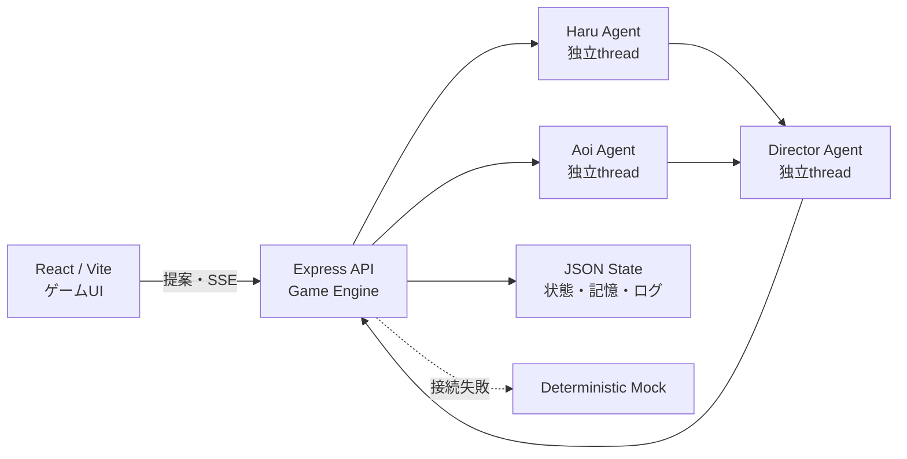

# ROOMMATES

> **ハッカソン審査員の方へ**
> ROOMMATESは、プレイヤーがキャラクターを操作するのではなく、二人のAIエージェントへ生活上の「きっかけ」だけを与える自律型恋愛シミュレーションです。HaruとAoiは同じ世界状態から独立して行動を決め、Directorエージェントが二人の意思を尊重しながら出来事を調停します。プレイヤーが望む展開になる保証はありません。

**「二人を恋に落とすのではない。恋が始まる場所をつくる。」**

## コンセプト

27歳のWebエンジニア・Haruと、26歳のグラフィックデザイナー・Aoiが、7日間のルームシェアを送ります。プレイヤーにできるのは、「一緒に夕食を作ってみたら？」「今日は映画を見よう」と提案することだけです。

二人は性格、感情、疲労、記憶、関係性を踏まえて、提案を受け入れる、断る、内容を変える、無視する、自分から別の行動を始める、のいずれかを自分で選びます。好感度だけで恋人になることはなく、告白する側と受ける側の意思が揃ったときにだけ恋が成立します。成立しなかった関係も、その二人らしいエンディングです。

## システム構成



| Workspace | 役割 |
| --- | --- |
| `apps/web` | React/Vite製のPC向け箱庭ゲームUI。2LDKの全景をメイン画面に、住人の現在地・短い会話・生活イベントと、入力を受け付ける案内役「デコピン」を描画します。 |
| `apps/server` | Express API、SSE、ゲームエンジン、状態保存、App Serverクライアント、モックエージェントを提供します。 |
| `packages/shared` | ゲーム状態、エージェント入出力、SSEイベント、Zodスキーマなどの共有型を管理します。 |

ゲームエンジンだけが状態を変更できます。各ターンでは、固定した同一スナップショットをHaruとAoiへ同時に渡し、両者の判断が揃ってからDirectorが実際の出来事を決めます。出力値は検証され、全ステータスは0〜100へ制限されます。

## 設計仕様

- [基本間取りと2Dゲーム画面](./docs/room-layout.md)
- [キャラクタースプライト](./docs/character-sprites.md)
- [家具・生活小物2Dドット素材](./docs/furniture-assets.md)
- [7日間の総集編・Agent感想・Producer評価リザルト](./docs/result-experience.md) — Issue #22で採用したP0設計。実装は進行中です。
- [Producer Score v1](./docs/result-scoring-v1.md) — 決定的な採点ルール、根拠、coverage、テストベクトル。
- [GameState v2](./docs/game-state-v2.md) — 全28ターンの正本ログ、Result状態、privacy、migration。
- [高速スキップ設計 v1](./docs/fast-skip.md) — Issue #33。決定論的ローカル進行、job、checkpoint、cancel、採点境界。

## Character Studio

ゲーム画面の「個性設定」から、HaruとAoiのプロフィールと10項目の個性値を個別に編集できます。個性値は0〜100で検証され、同じ提案でも受諾・修正・拒否・自発行動の傾向や台詞、行動理由へ違いが出ます。

- 名前、年齢、職業、人物紹介、好き／苦手、生活習慣、恋愛観、話し方を編集
- 10項目のスライダーと二人の比較表示
- キャラクター単位または全体を初期プリセットへ復元
- `localStorage`の`roommates.character-settings.v1`へゲーム状態と分離して保存
- 各ターンに同じ検証済み設定を送り、MockとCodex App Serverの両方で利用

ゲームをリセットしてもCharacter Studioの保存内容は残ります。保存済みJSONが壊れている場合は、安全に初期プリセットへ戻します。

## Codex App Serverをゲームランタイムとして使う

Codex App Serverは開発支援ではなく、ゲーム中の意思決定ランタイムです。

- **Haru thread**: Haru本人として提案への反応、行動、台詞を決めます。
- **Aoi thread**: Haruの判断を先に見ず、Aoi本人として独立に決めます。
- **Director thread**: 両者の行動案を受け取り、矛盾を解消して出来事と状態変化を提案します。

thread IDは役割ごとに分けられ、ランタイム情報として保持されます。UIの接続バッジとデバッグ表示から、App Server、OpenAI API、Mock、または一部だけフォールバックした状態を確認できます。UIと公開ログで扱うのは`action`、`dialogue`、`publicReason`だけです。生のChain of Thoughtや`internalSummary`は公開せず、GameState v2では永続化もしません。

各エージェント呼び出しには1回の再試行があります。`auto`ではフォールバックを速くするため15秒、明示的な`app-server`ではDirectorの生成完了を待てるよう60秒が既定です。接続エラー、タイムアウト、不正JSON、スキーマ不一致が起きた役割は、同じインターフェースを持つ決定論的モックへ自動的に切り替わります。そのため、Codex App Serverが利用できない環境でもゲームは最後まで進行できます。

### エージェントモード

| `AGENT_MODE` | 動作 |
| --- | --- |
| `auto` | 既定値。Codex App Serverへの実接続を試し、失敗した役割だけモックへフォールバックします。 |
| `mock` | Codexを起動せず、入力・状態・デモseedに反応するローカルモックだけを使います。安定した審査デモに推奨です。 |
| `app-server` | 実App Serverを優先します。デモ継続のため、最終的な安全フォールバックは無効化しません。 |

画面上の`fallback`は設定モードではなく、そのターンで実接続に失敗してモック結果を採用したことを表します。

### 公開版のAgent Worker

Cloudflare Workerはローカルプロセスを起動できないため、公開Sitesは認証付きのAgent WorkerへHTTPSで接続します。Agent WorkerがCodex App Serverをstdioで管理し、公開Sitesは`AGENT_WORKER_URL`が設定されている場合だけ実接続を試します。各役割の実行順は`Agent Worker → OpenAI Responses API → 決定論的モック`です。Agent Workerが未設定・停止・タイムアウト・非2xx・不正JSON・出力スキーマ不一致の場合、`OPENAI_API_KEY`が設定されていればOpenAI APIを試し、APIも未設定または失敗した場合だけモックでゲームを継続します。次のターンではAgent Workerから再試行するため、復旧後の再デプロイは不要です。

各ゲームセッションとHaru/Aoi/デコピン/Director/振り返りごとにApp Server threadを分離し、ゲームのリセット時には会話世代も切り替えます。各ターンではデコピン・Haru・Aoiの3 threadを同じスナップショットから並列に開始し、両キャラクターの判断が揃ってからDirectorがイベントを統合します。使われていない会話scopeは30分TTL・最大64scopeのLRUで削除します。Agent Workerのモデルは既定で`gpt-5.6-terra`、デコピン/Haru/Aoiの推論強度は`low`、Director/振り返りは`medium`です。この指定はAgent Worker内だけに適用され、普段のCodex設定は変更しません。Agent WorkerのBearer token、プレイヤー入力、モデル出力はログへ出しません。App Serverは既定で空の一時ディレクトリと最小限の環境変数から起動し、shell・web検索・MCPなどの外部ツールを無効にします。同時推論数は8、実推論開始数は既定60回/分に制限します。

ローカルでAgent Workerを起動する例:

```bash
AGENT_WORKER_TOKEN=local-development-secret npm run dev:agent-worker
```

別ターミナルでゲーム全体を同じ経路へ接続します。

```bash
AGENT_MODE=auto \
AGENT_WORKER_URL=http://127.0.0.1:3002 \
AGENT_WORKER_TOKEN=local-development-secret \
AGENT_WORKER_TIMEOUT_MS=60000 \
npm run dev
```

`GET http://127.0.0.1:3002/health`も同じBearer tokenが必要です。本番ではAgent Workerを永続的なNode.js/コンテナ環境で動かし、公開Sites側の`AGENT_WORKER_URL`、secretの`AGENT_WORKER_TOKEN`、必要に応じて`AGENT_WORKER_TIMEOUT_MS`を設定します。非loopback URLにはtokenとHTTPSが必須で、平文HTTPはローカル開発だけ許可されます。App ServerのWebSocket transportは使わず、安定版のstdioをAgent Worker内に閉じ込めます。

本番接続の手順は次のとおりです。

1. 永続的なNode.js/コンテナ環境で`npm run build`後に`NODE_ENV=production npm run start:agent-worker`を起動し、十分に長い`AGENT_WORKER_TOKEN`をsecretとして設定します。
2. Agent Workerの前段でTLSを終端し、外部へ公開するのはHTTPSの`/health`と`/v1/invoke`だけにします。
3. Bearer token付き`GET /health`が200を返すことを確認します。
4. 既存Sitesプロジェクトへ`AGENT_WORKER_URL`を通常の環境変数、同じ`AGENT_WORKER_TOKEN`をsecretとして設定し、Sites版を再デプロイします。

Agent WorkerとOpenAI APIの両方が未設定なら、公開版は意図どおりモックだけで動作します。

### 公開版のOpenAI APIフォールバック

既存SitesプロジェクトのSecretへ`OPENAI_API_KEY`を登録すると、Agent Workerを利用できない役割だけOpenAI Responses APIで実行します。キーはデータ共有を有効にしたAPIプロジェクトで発行し、通常の環境変数やフロントエンドの`VITE_*`、Git管理へ置かないでください。`/api/health`とブラウザへ公開するのは`openaiApiConfigured`という真偽値だけで、キー自体は返しません。

OpenAI API利用時は、プレイヤーが入力した指示と生成内容が、選択したAPIプロジェクトのデータ共有設定に従ってOpenAIと共有される場合があります。ゲーム画面も、APIフォールバックが設定済みの場合は送信欄の前にこの案内を表示します。直接API経路は`store: false`かつツール呼び出しなしで、各役割の構造化出力だけを生成して検証します。

Complimentary daily tokensはアプリが保証する無料枠ではありません。選択したAPIプロジェクトがその特典へ登録済みで、対象モデル・共有対象トラフィックであり、アカウント残高がプラスの場合にだけ自動適用されます。日次枠を超えたリクエストは通常料金で請求されるため、利用状況とCostsをOpenAI Platformで確認してください。対象条件と上限は[OpenAI公式のデータ共有・complimentary tokens案内](https://help.openai.com/en/articles/10306912-sharing-feedback-evaluation-and-fine-tuning-data-and-api-inputs-and-outputs-with-openai)を正本とします。

設計中の高速スキップは、外部モデルの遅延を完走条件にしません。未プレイフェーズは通常ターンと同じ制約を通る決定論的`simulation`で進め、App Serverは手動ターンと終了後のread-only reflectionで利用します。詳細は[高速スキップ設計 v1](./docs/fast-skip.md)を参照してください。

## 必要環境

- Node.js 20以上
- npm
- 実接続を使う場合のみ、認証済みのCodex CLIと利用可能な`codex app-server`
- 公開版で直接APIフォールバックを使う場合のみ、対象プロジェクトのOpenAI Project API key

## 起動方法

```bash
npm install
npm run dev
```

起動後に次を開きます。

- ゲームUI: <http://localhost:5173>
- API: <http://localhost:3001>
- ヘルスチェック: <http://localhost:3001/api/health>

ルートの`npm run dev`でWebとAPIを同時に起動します。Viteは`/api`をポート3001へプロキシします。

品質チェックは次の1コマンドです。

```bash
npm run check
```

これはTypeScript型チェック、単体テスト、プロダクションビルドを順に実行します。

## 実App Serverモードの設定

まずCodex CLIが起動できることを確認し、環境変数を付けて実行します。

```bash
codex --version
AGENT_MODE=auto CODEX_BIN=codex npm run dev
```

実接続を明示的に優先する場合:

```bash
AGENT_MODE=app-server CODEX_BIN=codex npm run dev
```

利用可能な設定は[`.env.example`](./.env.example)にまとまっています。

| 変数 | 既定値 | 説明 |
| --- | --- | --- |
| `AGENT_MODE` | `auto` | `auto`、`mock`、`app-server`から選択します。 |
| `CODEX_BIN` | `codex` | 起動するCodex CLIのコマンドまたはパスです。 |
| `APP_SERVER_TIMEOUT_MS` | `auto: 15000` / `app-server: 60000` | 1回のApp Server呼び出しのタイムアウトです。環境変数を指定した場合はその値を優先します。 |
| `PORT` | `3001` | Express APIのポートです。 |
| `GAME_STATE_FILE` | `./apps/server/data/game-state.json` | ゲーム状態を保存するJSONファイルです。 |
| `VITE_API_TARGET` | `http://localhost:3001` | Vite開発サーバーのAPI転送先です。 |
| `AGENT_WORKER_URL` | 未設定 | 設定時だけ認証付きAgent Worker経由でApp Serverを利用します。未設定時は従来のローカル実行、公開Sitesではモックです。 |
| `AGENT_WORKER_TOKEN` | 未設定 | 公開WorkerとAgent Workerの間で使うBearer tokenです。本番Agent Workerでは必須です。 |
| `AGENT_WORKER_TIMEOUT_MS` | `60000`（公開Worker） | Agent Worker呼び出しの上限です。公開Workerでは1000〜120000msへ制限します。 |
| `OPENAI_API_KEY` | 未設定 | Agent Workerが使えない場合のOpenAI APIフォールバック用Project API keyです。Sitesでは必ずSecretとして登録します。 |
| `OPENAI_API_MODEL` | `gpt-5.6-terra` | 直接OpenAI API経路で使うモデルです。complimentary tokensの対象可否は現在の公式案内とプロジェクト設定で確認します。 |
| `OPENAI_API_TIMEOUT_MS` | `30000` | 1回のOpenAI API呼び出し上限です。1000〜120000msの範囲で必要な場合だけ上書きします。 |
| `AGENT_WORKER_PROBE_TIMEOUT_MS` | `2000` | Agent Worker/App Serverの起動確認上限です。停止時はこの短い確認後にモックへ切り替えます。 |
| `AGENT_WORKER_MAX_CONCURRENT_INVOCATIONS` | `8` | Agent Worker全体で同時に実行できる推論数です。超過時は429を返し、ゲーム側はモックへ切り替えます。 |
| `AGENT_WORKER_MAX_INVOCATIONS_PER_MINUTE` | `60` | Agent Worker全体で1分間に開始できる実推論数です。冪等キャッシュの再利用は消費しません。 |
| `AGENT_WORKER_REQUEST_TIMEOUT_MS` | `180000` | Agent WorkerのHTTPリクエスト上限です。 |
| `AGENT_WORKER_APP_SERVER_REQUEST_TIMEOUT_MS` | `30000` | Agent Worker内のApp Server RPC応答上限です。初回のモデル初期化もこの範囲で待機します。旧`APP_SERVER_REQUEST_TIMEOUT_MS`も利用できます。 |
| `AGENT_WORKER_APP_SERVER_TURN_TIMEOUT_MS` | `50000` | Agent Worker内の1回のモデルturn上限です。公開側の呼び出し上限より短く設定します。旧`APP_SERVER_TURN_TIMEOUT_MS`も利用できます。 |
| `AGENT_WORKER_MODEL` | `gpt-5.6-terra` | Agent Worker内の全役割で使うモデルです。普段のCodex設定には影響しません。 |
| `AGENT_WORKER_FAST_REASONING_EFFORT` | `low` | デコピン、Haru、Aoiの推論強度です。 |
| `AGENT_WORKER_DELIBERATE_REASONING_EFFORT` | `medium` | DirectorとHaru/Aoiの振り返りの推論強度です。 |
| `AGENT_WORKER_SHUTDOWN_TIMEOUT_MS` | `10000` | Agent Worker終了時の猶予です。 |
| `AGENT_WORKER_IDEMPOTENCY_TTL_MS` | `300000` | 同一実行結果を再利用する期間です。 |
| `AGENT_WORKER_IDEMPOTENCY_MAX_ENTRIES` | `256` | 冪等実行キャッシュの最大件数です。 |
| `AGENT_WORKER_CWD` | 空の一時ディレクトリ | App Serverへ見せる作業ディレクトリです。本番で変更する場合は`AGENT_WORKER_ALLOW_CUSTOM_CWD=true`も必要です。 |

`.env`を使う場合は、現在のシェルへ読み込んでから起動してください。

```bash
cp .env.example .env
set -a
source .env
set +a
npm run dev
```

## モックモード

Codex CLIやネットワーク接続なしで確実に動かすには、次のように起動します。

```bash
AGENT_MODE=mock npm run dev
```

モックは固定シナリオではありません。料理、映画、掃除、謝罪、会話、花などの提案を分類し、各キャラクターの体力、ストレス、信頼、性格、時間帯、デモseedから判断します。同じseedと同じ状態なら再現可能で、入力や状態が変われば反応も変わります。

## 3分デモ手順

審査デモは`AGENT_MODE=mock`が最も再現性があります。実接続を見せる場合は`auto`で起動し、接続バッジとthread IDも合わせて紹介してください。

1. **0:00–0:30 — コンセプト**
   Day 1 / Morning、常時見える2LDKの全景とそこで暮らす二人、右の状態／予定タブを見せ、「操作ではなく、生活を見守ってきっかけだけを与えるゲーム」と説明します。
2. **0:30–1:15 — 独立判断**
   「一緒に夕食を作ってみたら？」と入力します。住人の頭上と画面上部の3段階インジケーターが、Haru、Aoi、できごとの順に進み、キッチンへ注目が移る様子を見せます。
3. **1:15–1:45 — 結果と記憶**
   部屋の中の短い会話、二人の異なる判断、Directorのナレーション、energy・trust・affection等の変化を示します。必要なら下部の「最新の生活ログ」から全記録を開きます。
4. **1:45–2:20 — 自律性**
   「何もせず見守る」または別のプリセットを選び、二人が拒否・修正・自発行動も選べることを見せます。
5. **2:20–2:45 — 7日間の変化**
   `Fast Forward`で数日進め、恋愛の緊張、告白機会、または別のエンディングまで進めます。好感度だけでは恋人にならない点を説明します。
6. **2:45–3:00 — App Server runtime**
   デバッグ表示でHaru/Aoi/Directorの独立thread IDと、各役割の`app_server`・`openai_api`・`mock`・`fallback`状態を見せます。

## API概要

| Method | Path | 説明 |
| --- | --- | --- |
| `GET` | `/api/health` | APIと現在のランタイム状態を確認します。 |
| `GET` | `/api/game` | 現在のゲーム状態を取得します。 |
| `POST` | `/api/game/turn` | 提案を送り、SSEで思考段階と結果を受け取ります。 |
| `POST` | `/api/game/advance` | 解決済みターンから次の時間帯へ進みます。 |
| `POST` | `/api/game/fast-forward` | 現行デモ用の同期高速進行です。Issue #33でjob型`/api/game/skip`へ移行予定です。 |
| `POST` | `/api/game/reset` | 初期状態へ戻します。 |

## データと安全性

- プレイヤー入力は命令ではなく、信頼できないゲーム内提案データとして分離して渡します。
- HaruとAoiはゲーム状態や保存ファイルを直接更新できません。
- Directorの出力もZodで検証し、ゲームエンジンが0〜100へクランプしてから適用します。
- 同じターンの二重実行は、状態ロック、revision、idempotency keyで防ぎます。
- 状態、共有記憶、イベントログはローカルJSONへ保存されます。
- OpenAI API keyはSitesのSecretからサーバー側だけで読み、公開ヘルス情報には設定済みかどうかの真偽値だけを出します。
- OpenAI API経路が有効な場合は、入力と生成内容がAPIプロジェクトのデータ共有設定に従って共有される可能性を送信前に案内します。
- UIはReactの通常レンダリングを使用し、入力をHTMLとして挿入しません。

## 既知の制約

- ハッカソン向けのローカル・単一ゲームセッション実装です。認証、複数ユーザー、クラウド同期はありません。
- 実App Serverの応答速度と内容は、インストール済みCodex CLI、モデル、実行環境に依存します。
- 実接続が利用できても、個別エージェントのタイムアウトや不正出力により一部ターンだけモックへ切り替わることがあります。
- モックの自然言語理解は日本語キーワードと状態ベースの簡易判定です。
- PCでの短時間デモを優先しており、モバイル最適化や網羅的なUIテストは限定的です。
- 今日の予定はUI検証用のデイリープランです。現在の目標と場所はゲーム状態へ追従しますが、予定そのものの永続化やエージェント判断への入力は今後の拡張対象です。
- 間取りは24×18タイルの論理座標を1280×720のアイソメトリック表示へ投影しています。家具は生成済みPNGを共通manifestから配置し、住人の全景表示はSVG/CSSの簡易表現、デコピンとリザルト内の住人は生成スプライトを使用します。
- キャラクター移動はイベント／部屋ごとの固定アンカーです。自由歩行、経路探索、家具との詳細な当たり判定は今後の拡張対象です。
- 本格的な3D描画、音声、認証、ランキング、家具購入は対象外です。

## 設計済み・実装中のP0

- 7日間の総集編、注目イベント、Haru/Aoiの振り返り、説明可能なProducer評価リザルト
- 決定論的ローカル進行による高速スキップjob、進捗、cancel、再起動復旧

## 今後の発展案

- 長期記憶の検索・要約と、キャラクターごとの非対称な記憶
- 家具、場所、仕事、天気が行動へ影響する生活シミュレーション
- キャラクターと性格プロファイルの追加
- App Server threadの再開・観察・リプレイUI
- 告白以外の関係イベントと、より多様なエンディング
- 音声、表情差分、Live2D、サウンドによる演出強化
- セーブスロット、シナリオ共有、観戦モード

## 開発コマンド

```bash
npm run dev        # Web + API
npm run dev:agent-worker # 認証付きApp Serverゲートウェイ
npm run typecheck  # 全workspaceの型チェック
npm test           # 主要ロジックとAPIテスト
npm run build      # 全workspaceの本番ビルド
npm run check      # typecheck + test + build
npm start          # ビルド済みAPIを起動
```
