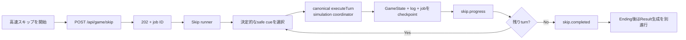

# ROOMMATES 高速スキップ設計 v1

- Status: Accepted
- Issue: [#33 決定論的ローカル進行による高速スキップをjob化する](https://github.com/aieo-product/roommates-autonomous-life-sim/issues/33)
- Parent contracts: [GameState v2](./game-state-v2.md) / [Producer Score v1](./result-scoring-v1.md) / [7日間リザルト設計](./result-experience.md)
- Related: [#3 App Server基盤](https://github.com/aieo-product/roommates-autonomous-life-sim/issues/3) / [#10 イベント制約](https://github.com/aieo-product/roommates-autonomous-life-sim/issues/10) / [#18 最終選択](https://github.com/aieo-product/roommates-autonomous-life-sim/issues/18) / [#22 リザルト](https://github.com/aieo-product/roommates-autonomous-life-sim/issues/22) / [#25 永続化パス](https://github.com/aieo-product/roommates-autonomous-life-sim/issues/25) / [#26 MVP Epic](https://github.com/aieo-product/roommates-autonomous-life-sim/issues/26)

## 目的

現行の同期`POST /api/game/fast-forward`を、全28フェーズの正本ログを維持しながら短時間・再接続可能・キャンセル可能に進める永続サーバージョブへ置き換える。

高速スキップは「App Serverを高速に連続実行する機能」ではない。通常ターンと同じゲームルールを、決定論的ローカルシミュレーションで進める機能とする。外部モデルの遅延や障害を完走条件から外し、App Serverは通常の手動ターンと終了後のread-only reflectionで利用する。

## 決定事項

- 高速スキップのゲーム進行クリティカルパスではApp Serverを呼ばない。
- 既存Mockを基礎に、商品機能として明示した決定論的`simulation` coordinatorを用いる。
- スキップでも通常ターンと同じcue安全化、Character decision、Director制約、effect budget、state更新、Ending判定、structured log生成を通す。
- 1フェーズごとにGameStateとjob進捗をcheckpointする。
- HTTP/SSE切断後もjobを継続し、サーバー再起動時は最後のcheckpointから再開する。
- 1ターン以上スキップした後は手動プレイ用App Server threadを無効化し、現在の正本stateから新しいthreadを開始する。
- Ending後のProducer Scoreは決定的に確定する。App Serverを使うreflectionは別処理とし、skip完了をブロックしない。
- `fast_forward` turnはcoverage、状態、Ending、記事、highlightへ含めるが、Producer Scoreの直接的な加減点根拠にはしない。

## 非スコープ

- 全skip turnをApp Serverで生成するAI完全進行
- skip中の日境界や重要イベントでApp Serverを呼ぶanchor方式
- App Serverクライアント本体のschema、初期化、timeout、interrupt修正
- 複数ユーザー、分散queue、分散lock
- 巻き戻し、任意位置へのpause
- Ending、イベント、スコアルール自体の変更

## 実行フロー



SSEは表示更新用であり、永続化されたjobとGameStateを正本とする。ブラウザ切断はrunnerを中断しない。

## API契約

### 開始

`POST /api/game/skip`

```json
{
  "target": { "kind": "turns", "count": 8 },
  "revision": 4,
  "idempotencyKey": "56eed3df-b610-40bc-a8df-37e7e3814052"
}
```

Endingまで進める場合は`target: { "kind": "ending" }`とする。

- 新規jobは`202 Accepted`とjob snapshotを返す。
- `turns.count`は1〜28の整数。不正値を暗黙clampせず400にする。
- stale revision、別job実行中、resolving中、ended後は409にする。
- 同一idempotency key・同一requestは既存job receiptを返す。
- 同一key・異なるrequestは409にする。
- countは新しく追加するstructured log数を表す。
- countが残りフェーズ数を超える場合はDay 7 Nightで停止する。
- 開始時が`resolved`なら最初にadvanceしてから1ターン目を処理する。

### 状態・進捗・キャンセル

- `GET /api/game/skip/:jobId`: checkpoint済みのjob snapshotを返す。
- `GET /api/game/skip/:jobId/events`: 現在snapshotから始まるSSEを返す。
- `DELETE /api/game/skip/:jobId`: cancelを要求する。

SSE event:

- `skip.started`
- `skip.progress`
- `skip.completed`
- `skip.cancelled`
- `skip.failed`

`skip.progress`はturn checkpointの保存後だけ送る。cancelは現在のローカルturnを原子的に完了させ、次のturn開始前に停止する。完了済みturnは巻き戻さない。

旧`POST /api/game/fast-forward`はWeb移行後に削除する。短期互換aliasを置く場合も新job開始だけを行い、同期loopは残さない。

## 永続job契約

```ts
type SkipTarget =
  | { kind: "turns"; count: number }
  | { kind: "ending" };

type SkipJobStatus =
  | "queued"
  | "running"
  | "cancel_requested"
  | "cancelled"
  | "completed"
  | "failed";

type PersistedSkipJob = {
  id: string;
  idempotencyKey: string;
  requestHash: string;
  status: SkipJobStatus;
  target: SkipTarget;
  policyVersion: "fast-skip-v1";
  startRevision: number;
  startEventLogCount: number;
  targetEventLogCount: number;
  completedTurns: number;
  totalTurns: number;
  sequence: number;
  lastCheckpointRevision: number;
  lastCompletedTurnId?: string;
  lastCompletedEventLogId?: string;
  createdAt: string;
  updatedAt: string;
  cancelRequestedAt?: string;
  completedAt?: string;
  error?: { code: string; retryable: boolean };
};
```

- 非terminal jobはrun内に最大1件とする。
- `idempotencyKey`、`requestHash`、内部errorはPublic DTOへ出さない。
- Public DTOは`activeSkip`と`lastSkip`の安全なsnapshotだけを返す。
- job metadata更新だけではgameplayの`revision`を増やさない。
- jobごとのturn keyは`skip:{jobId}:{eventOrdinal}`とする。
- `jobId + eventOrdinal`をrun内で一意とし、同じstepを二重commitしない。
- terminal receiptは直近20件まで保持する。
- migrationでは既存saveに空のskip controlを補う。

各`fast_forward` logには次を保存する。

```ts
type FastSkipTrace = {
  jobId: string;
  step: number;
  policyVersion: "fast-skip-v1";
};
```

`CueResolution.inputMethod === "fast_forward"`ならtraceを必須とし、それ以外では禁止する。runtime provenanceは`source: "simulation"`とし、意図的な高速進行を開発用`mock`や障害時`fallback`と区別する。

## canonical turn pipeline

通常turnとskip turnでstate更新を複製しない。

```ts
executeTurn({
  suggestion,
  revision,
  idempotencyKey,
  inputMethod,
  coordinator,
  executionTrace,
});
```

手動turnは`ResilientAgentCoordinator`、高速スキップは`DeterministicSimulationCoordinator`を注入する。次は共通処理とする。

- Producer cueの安全化とEventDefinition選択
- Haru/Aoiの独立Decision
- Director resolution
- event policy、consent、effect budget
- Before/After、applied effects、memory、conflict
- relationshipとEnding判定
- structured event log生成
- repository save

高速スキップ専用処理からGameStateを直接まとめて書き換えない。

## 決定的cueとsimulation

cueは`seed + day + phase + event ordinal + policyVersion`から純粋関数で選ぶ。

優先順位:

1. energy低下またはstress上昇時はrest/observe
2. 未解決conflictがあり条件を満たす場合は修復機会
3. cooldown、phase、usage cap、intimacy条件を満たすイベント
4. 同条件ではseed付きhashで決定し、同categoryの連続を避ける

同じ開始state、seed、target、policyVersionでは、IDとtimestampを除いたcue、Decision、解決結果、Endingが一致しなければならない。raw入力は作らず、安全化済みcueだけをログへ保存する。

## 排他・checkpoint・復旧

- job開始からterminalまでbatch lockを保持する。
- 実行中のturn、advance、reset、別skipは409にする。
- 各turnのGameState、structured log、job progressを同じcheckpointとして保存する。
- 保存前に失敗したturnは`completedTurns`へ含めない。
- 保存済みturnはcancel、失敗、再起動でも巻き戻さない。
- 起動時に`queued / running / cancel_requested`を検出し、最後のcheckpointから再開またはcancel完了する。
- `status: "resolving"`からの復旧は、同一skip turn keyで安全に再実行する。
- jobの`completedTurns`は、そのjobに属する保存済みstructured log件数と常に一致させる。

runnerの内部失敗は最後の正常checkpointを保持して`failed`にする。外部モデル障害はskip runnerのfailure条件にならない。

## App Server境界

高速スキップ中:

- Haru/Aoi/DirectorのApp Server RPCを0回にする。
- App Server timeoutやfallbackを待たない。
- 既存App Server threadへskipイベントを追記しない。
- 1turn以上commitした時点で手動プレイ用threadをstaleとして無効化する。
- cancel後に手動プレイへ戻る場合も、現在の正本snapshotから新しいthreadを作る。

ゲーム終了後:

- EndingとProducer Scoreを先に決定・保存する。
- Haru/Aoi reflectionでApp Serverを使う場合はread-only専用threadとする。
- reflectionの成功・失敗は`skip.completed`をブロックしない。
- Result生成中は既存の`GameResult.status`契約で表示する。

## Producer ScoreとResultの境界

`fast_forward` turnは全28turnのdata coverage、状態遷移、Ending、記事、highlightへ含める。一方、システムが選んだcueをProducer本人の意思として扱わないため、そのturn自体をProducer Scoreのpositive/negative evidenceにしない。

- 「次のProducer介入」探索では`fast_forward`を除外する。
- skip中の受諾、拒否、修復、conflict、category増加をProducer起因の直接根拠にしない。
- chronologicalなphase経過、後続turnのBefore state、cooldownには含める。
- 後続の手動介入は、その時点の実状態を使って通常どおり評価する。
- runtimeが`simulation / app_server / fallback`のどれかは点数へ影響させない。

```ts
type ProducerInteractionCoverage = {
  controlledTurns: number;
  skippedTurns: number;
  assessment: "standard" | "assisted" | "reference";
};
```

- `standard`: skipなし
- `assisted`: 手動turnとskip turnが混在
- `reference`: 全turnが自動進行

これはデータ欠損を表す既存`coverage`とは別であり、点数へ直接加減しない。UIではランクと並べて明示する。

## Web体験

- 「8ターン進める」と「エンディングまで進める」を提供する。
- 実行前に、未プレイ時間はApp Serverではなくローカルsimulationで進むと明示する。
- 完了フェーズ数/全フェーズ数、最後のDay/phase、cancel操作を表示する。
- `aria-live="polite"`で進捗を通知する。
- skip中は提案、advance、reset、別skipを無効化する。
- reload時は`PublicGameState.activeSkip`から進捗を復元し、SSEへ再接続する。
- completed時は`GET /api/game`で正本stateを再取得する。
- timelineでは対象turnへ「自動進行」バッジを付ける。
- `simulation`をApp Server障害やfallback警告として表示しない。

## 実装順

1. Shared型、Zod schema、migration、Public DTO
2. canonical turn pipelineの分離
3. 決定的cue selectorとsimulation coordinator
4. skip job永続化、batch lock、checkpoint、起動時resume
5. API、SSE、cancel、旧fast-forward移行
6. App Server thread invalidation
7. Web進捗、再接続、cancel、自動進行表示
8. Producer interaction coverageとResult表示

## P0完了条件

- [ ] 初期状態からEndingまで進み、Day 7 Nightを含む28件のstructured logと`status: "ended"`を保存する
- [ ] 全skip logが`inputMethod: "fast_forward"`、`source: "simulation"`、job traceを持つ
- [ ] skip中のApp Server呼び出しが0回
- [ ] 同じ開始stateとseedではID・timestampを除く結果が一致する
- [ ] 8turn指定は最大8件だけ新規logを追加する
- [ ] cancel、SSE切断、reload、server restartでcheckpoint済みturnを失わない
- [ ] 同じidempotency keyの再送で重複turnを作らない
- [ ] stale revisionと競合操作を409で拒否する
- [ ] skip後の最初の手動App Server turnは新しいthreadを使う
- [ ] 通常turnと同じevent policy、consent、effect budget、Ending処理を通る
- [ ] skip自身からProducer Score evidenceが生成されず、data coverageは完全なまま
- [ ] memory repositoryを使うEnding統合テストがApp Server timeoutを待たず5秒以内に完了する
- [ ] 旧同期fast-forward loopが残っていない
- [ ] `npm run check`が成功する

## テスト観点

- Shared/schema: target union、count境界、公開/永続DTO分離、migration
- Engine: 8turn、Ending、残りturn、phase順、決定性、cancel境界、保存失敗、再起動復旧
- Policy: availability、cooldown、usage cap、consent、confession、stress/energy、category分散
- App Server境界: adapter呼び出し0、thread invalidation、次手動turnの新thread
- API/SSE: 202/400/404/409、event順序、再接続、idempotency
- Web: 進捗、disabled、cancel、reload復旧、`aria-live`、自動進行表示
- Score: `standard / assisted / reference`、skip evidence除外、data coverage 100%
