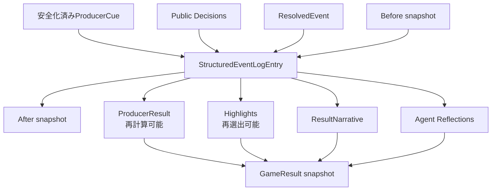

# ROOMMATES GameState v2

- Status: Accepted
- Parent design: [7日間リザルト設計](./result-experience.md)
- Scoring: [Producer Score v1](./result-scoring-v1.md)
- Execution contract: [高速スキップ設計 v1](./fast-skip.md)
- Issue: [#22](https://github.com/aieo-product/roommates-autonomous-life-sim/issues/22)

## 目的

GameState v2は、全28フェーズを後から推測せずに再生・採点・記事化できる正本ログと、終了時の保存済みResultを定義する。

現行v1には次の不足がある。

- `lastDecision`は最終turn分しか残らない
- `haruReaction / aoiReaction`は文字列で、Decisionを安全に復元できない
- states Before/After、実効果、memory参照、conflict lifecycleがない
- `gameStateSchema`のeventLog、Ending、runtimeが`z.any()`
- Webが構造化Endingを文字列へ平坦化する
- `internalSummary`が永続GameStateとAPIレスポンスへ残り得る

## 正本と派生物



- `eventLog`をrunの正本とする。
- Scoreとhighlightは正本ログから再計算できるが、表示の安定性のためversion付き計算結果も保存する。
- Narrativeとreflectionは生成済みスナップショットを保存し、reloadのたびに再生成しない。
- 現在の1run保存を維持する。reset後の履歴保存・比較はP1とする。

## 情報分類

| 分類 | 例 | 永続化 | API/UI | Score/記事 |
| --- | --- | :---: | :---: | :---: |
| 公開事実 | action、dialogue、publicReason、Director narration | 可 | 可 | 可 |
| 共有状態 | CharacterState、relationship、shared memory、conflict | 可 | 可 | 可 |
| 安全メタデータ | safety flag、lock、fallback、runtime source | 可 | 必要範囲のみ | Score可 |
| 一時的な私的要約 | `internalSummary` | **不可** | **不可** | **不可** |
| Agent予測 | `expectedEffects` | turn処理中のみ | 不可 | 不可 |
| 安全化前の入力 | raw Producer input | **不可** | **不可** | **不可** |

`internalSummary`はCharacter Agent呼び出し内の一時データとしてだけ扱い、v2の`CharacterRecord`、EventLog、Result、JSON保存、API DTOから除外する。

## Conflictの安定ID

記事と採点で「発生した対立」と「後日解決した同じ対立」を結ぶため、文字列配列だけでなく安定IDを持つ。

```ts
type ConflictRecord = {
  id: string;
  summary: string;
  createdByEventLogId: string;
  createdAt: { day: number; phase: Phase };
  resolvedByEventLogId?: string;
  resolvedAt?: { day: number; phase: Phase };
};
```

`SharedState`はactiveな`unresolvedConflictIds`と、run中の`conflicts`を保持する。v1の文字列conflictはmigration時に安定IDを割り当てるが、発生turnが不明なためcoverage warningを付ける。

## StructuredEventLogEntry

### 公開Decision

```ts
type PublicCharacterDecision = Pick<
  CharacterDecision,
  "decision" | "action" | "dialogue" | "publicReason"
>;
```

### Snapshot

```ts
type ResultCharacterSnapshot = Pick<
  CharacterState,
  | "energy"
  | "stress"
  | "affection"
  | "trust"
  | "romanticAwareness"
  | "mood"
  | "location"
  | "currentGoal"
>;

type ResultSharedSnapshot = {
  relationshipLabel: RelationshipLabel;
  unresolvedConflictIds: string[];
  memoryIds: string[];
};

type TurnSnapshot = {
  characters: Record<CharacterId, ResultCharacterSnapshot>;
  shared: ResultSharedSnapshot;
};
```

### Producer cueの解決

```ts
type FastSkipTrace = {
  jobId: string;
  step: number; // 1始まり。job内で一意
  policyVersion: "fast-skip-v1";
};

type CueResolution = {
  inputMethod: "free_text" | "candidate" | "observe" | "fast_forward";
  cue: ProducerCue; // 安全化・正規化済み
  requestedEventId?: string;
  alternativesShown: EventCandidate[];
  selectedEvent: EventCandidate;
  lock?: EventLock;
  outcome: "selected" | "transformed" | "locked_fallback" | "observed";
  skip?: FastSkipTrace;
};
```

`ProducerCue`全体を保存することで、category、`pressure` tag、安全変換、observeを後から判定できる。候補カード、自由入力、見守る、fallbackのどの経路でも同じ契約へ正規化する。

`inputMethod === "fast_forward"`では`skip`を必須とし、それ以外では禁止する。高速スキップはraw入力を作らず、システムが選んだ安全化済みcueだけを保存する。`jobId + step`はrun内で一意とし、同じstepを二重commitしない。

### Turn record

```ts
type ResolutionBranch =
  | "both_participated"
  | "one_participated"
  | "both_declined"
  | "modified"
  | "self_initiated"
  | "fallback";

type StructuredEventLogEntry = {
  id: string;
  turnId: string;
  day: number;
  phase: Phase;
  createdAt: string;

  cueResolution: CueResolution;
  decisions: Record<CharacterId, PublicCharacterDecision>;
  resolutionBranch: ResolutionBranch;

  before: TurnSnapshot;
  after: TurnSnapshot;
  appliedEffects: Record<CharacterId, StatDelta>;
  memory?: Memory;
  conflictUpdate?: {
    added: ConflictRecord[];
    resolvedIds: string[];
  };

  eventTitle: string;
  narration: string;
  runtime: Record<AgentId, Pick<RuntimeAgentState, "source" | "latencyMs">>;
};
```

EventDefinitionは後日更新され得るため、採点時に現在のcatalogを再参照せず、`selectedEvent`のid、title、category、intimacyTierをturn時点の値として保存する。

`before`はAgentへ渡したfreeze snapshot、`after`は制約適用後に保存する状態と一致させる。`appliedEffects`は`after - before`と一致するか検証し、Agentの予測値ではなく実適用値を正本とする。

高速スキップturnでは`RuntimeAgentState.source`を`"simulation"`へ拡張する。これは意図的なローカル進行であり、開発用`mock`やApp Server障害時の`fallback`と区別する。実行元の違いはstate適用ルールやProducer Scoreを変更しない。

全28フェーズを欠落させない。現行`slice(-50)`は件数上は満たすが、v2では`MAX_RUN_TURNS = 28`を明示し、ended状態で28件あることを検証する。

## 高速スキップjob

高速スキップはHTTPリクエスト内の同期loopではなく、永続化されたbackground jobとして実行する。完全なAPI、状態、排他、checkpoint、App Server境界は[高速スキップ設計 v1](./fast-skip.md)を正本とする。

```ts
type SkipControl = {
  jobs: PersistedSkipJob[]; // terminal receiptは直近20件まで
};

type GameStateV2 = {
  // existing fields
  skipControl: SkipControl;
};
```

- 非terminal jobはrun内に最大1件とする。
- GameState、structured log、jobの`completedTurns`とcheckpoint revisionを1フェーズごとに同じ永続化境界で確定する。
- 同じidempotency keyの再送は新しいjobを作らず、保存済みreceiptを返す。
- 実行中の通常turn、advance、reset、別skip開始は409にする。
- cancel、SSE切断、プロセス再起動でcheckpoint済みturnを巻き戻さない。
- 起動時は最後のcheckpointから再開し、同じ`jobId + step`のログを重複させない。
- 既存saveのmigrationでは`skipControl.jobs = []`を補う。

## Resultの保存契約

### Highlight

```ts
type ResultHighlight = {
  id: string;
  kind:
    | "relationship_turn"
    | "self_initiated"
    | "respected_no"
    | "conflict_repaired"
    | "quiet_moment"
    | "important_memory";
  headline: string;
  reason: string;
  eventLogIds: string[];
  memoryId?: string;
};
```

IDだけでなく選出種別、見出し、理由を保存し、UIと再計算結果の差分を検証できるようにする。

### Narrative

```ts
type NarrativeParagraph = {
  text: string;
  sourceEventLogIds: string[];
};

type DailyNarrativeSection = {
  day: number;
  title: string;
  paragraphs: NarrativeParagraph[];
  featuredEventLogId?: string;
};

type ResultNarrative = {
  headline: string;
  lead: NarrativeParagraph[];
  daySections: DailyNarrativeSection[]; // schemaでDay 1〜7を一度ずつ要求
  closing: NarrativeParagraph[];
  narrativeVersion: string;
};
```

`daySections`内の`sourceEventLogIds`の和集合は、completeなrunでは28件すべてを含む。段落単位で根拠へ移動できることをschemaとテストで保証する。

### ProducerResult

```ts
type ResultEvidence = {
  id: string;
  ruleId: string;
  points: number;
  message: string;
  eventLogIds: string[];
};

type ProducerResult = {
  overallScore: number;
  rank: "S" | "A" | "B" | "C";
  producerStyle:
    | "space_maker"
    | "condition_reader"
    | "relationship_mender"
    | "pace_designer"
    | "turning_point_editor";
  scoringVersion: "producer-v1";
  axes: ResultScoreAxis[];
  topStrengths: ResultEvidence[];
  improvements: ResultEvidence[];
  highlights: ResultHighlight[];
  keyMemoryIds: string[];
  turningPointEventLogIds: string[];
  statJourney: {
    start: TurnSnapshot;
    end: TurnSnapshot;
  };
  coverage: {
    ratio: number;
    completeTurns: number;
    expectedTurns: number;
    missing: string[];
  };
  warnings: string[];
};
```

### Reflection

```ts
type AgentResultReflection = {
  characterId: CharacterId;
  seasonImpression: string;
  notableEventComments: Array<{
    eventLogId: string;
    comment: string;
  }>;
  bestMomentEventLogId: string | null;
  turningPointEventLogId: string | null;
  messageToProducer: string;
  reflectionVersion: string;
  runtime: RuntimeAgentState;
};
```

参照するevent IDは、各Agentへ渡した公開timelineに存在するものだけを許可する。

### GameResult state

```ts
type ResultFailure = {
  component: "narrative" | "haru_reflection" | "aoi_reflection";
  reason: string;
  retryable: boolean;
};

type ResultGenerationIdentity = {
  generationKey: string;
  endingRevision: number;
  scoringVersion: "producer-v1";
  narrativeVersion: string;
  reflectionVersion: string;
};

type GameResult =
  | (ResultGenerationIdentity & {
      status: "generating";
      ending: Ending;
      producer: ProducerResult;
      startedAt: string;
    })
  | (ResultGenerationIdentity & {
      status: "ready";
      ending: Ending;
      producer: ProducerResult;
      narrative: ResultNarrative;
      reflections: Record<CharacterId, AgentResultReflection>;
      generatedAt: string;
      dataQuality: "complete";
    })
  | (ResultGenerationIdentity & {
      status: "partial";
      ending: Ending;
      producer: ProducerResult;
      narrative?: ResultNarrative;
      reflections: Partial<Record<CharacterId, AgentResultReflection>>;
      failures: ResultFailure[];
      generatedAt: string;
      dataQuality: "partial";
    });
```

`generationKey`は`seed + endingRevision + scoringVersion + narrativeVersion + reflectionVersion`から作る。同じkeyのResultが`ready`または`partial`なら再生成しない。

## 終了処理

1. Day 7 Nightを通常どおり解決する。
2. structured log、Ending、`status: "ended"`を先に保存する。
3. 純粋関数でProducerResultとhighlightを確定する。
4. `GameResult.status: "generating"`を保存し、`result.generating`を送る。
5. Haru/Aoiの専用reflectionを並列実行する。
6. Directorの既存narrationと構造化ログから決定的な記事を構成する。
7. schema検証後、`ready`または`partial`を保存して`result.completed`を送る。

後段の失敗で、Ending、ログ、ProducerResultを巻き戻さない。SSE切断時は`GET /api/game`から保存済み状態を復旧する。

## Reflection専用Agent

既存のHaru/Aoi threadは`CharacterDecision`出力を要求するbase instructionを持つため、異なるreflection schemaに使い回さない。`haru_reflection`と`aoi_reflection`のread-only専用threadを作る。

入力に含めてよいもの:

- 共有ログ、共有memory、Ending
- 本人の全PublicCharacterDecision
- 相手の公開action、dialogue、publicReason
- 本人の最終CharacterState
- 選出済みhighlight IDs

含めてはいけないもの:

- 本人または相手の`internalSummary`
- 相手だけの非公開情報
- Producer Score、ランク、加減点根拠
- raw入力、runtime error、Director内部情報
- もう一方のreflection

reflectionはScore、Ending、Memory、CharacterStateを変更しない。取得失敗時は保存済みpublicReasonを「当時の反応」として表示し、存在しない振り返りを捏造しない。

## Public API DTO

永続GameStateをそのままExpressから返さず、`PublicGameState`へ射影して返す。

- `internalSummary`、raw入力、runtime errorを除外する
- EndingとGameResultを構造化型のまま返す
- skip jobの`idempotencyKey`、request hash、内部errorを除外し、`activeSkip`と`lastSkip`の安全な進捗snapshotだけを返す
- Webは`@roommates/shared`の公開型とschemaを利用し、同じ型を重複定義しない
- v1互換入力はserver migrationで処理し、Webの寛容な推測を増やさない

現行`apps/web/src/api.ts`は`root.result`をcurrent event候補として扱うため、GameResult導入前にこのfallbackを削除する。`ending?: string`への平坦化も廃止する。

## Web view model

`PublicGameState`から表示専用`WebGameViewModel`へ一方向に変換する。

- `status !== "ended"`: 現行GameScreen
- `status === "ended"`: ResultScreen
- `activeSkip.status`が非terminal: 完了数、全turn数、最後のDay/phase、cancelを表示し、通常操作を無効化
- `result.status === "generating"`: scoreを先に表示し、記事と感想を`aria-live`で待機
- `result.status === "partial"`: 取得できた内容と失敗理由を表示

「同じseedでもう一度」のため、Web view modelへ`seed`を保持する。「新しいseed」はreset時に新規seedを明示送信する。現行の固定`demo-heart`を暗黙利用しない。

現行CSSはゲームHUD向けの`overflow: hidden`と最小幅を持つため、ResultScreenは独立した縦スクロール領域、16px以上の本文、`@media print`を持つ。

## v1からのmigration

1. `gameStateSchemaV1`で旧データを読む。
2. v1の公開Reaction文字列、event title、narration、relationship遷移を保持する。
3. 復元できないDecision、Before/After、cue resolutionは推測せずmissingへ記録する。
4. conflict文字列へ安定IDを付け、発生元不明warningを付ける。
5. `version: 2`と`dataQuality: "partial"`で保存する。
6. 既にendedでもcoverage不足なら断定ランクを作らない。

新規v2データは具体的Zod schemaで検証し、eventLog、Ending、runtime、Resultに`z.any()`を使わない。

## 変更対象

| 層 | 主なファイル |
| --- | --- |
| Shared | `packages/shared/src/domain.ts`、`schemas.ts`、`initial.ts`、新規`migrations.ts` |
| Engine | `apps/server/src/engine/game-engine.ts`、新規`engine/result/*` |
| Skip | 新規`engine/skip-policy.ts`、`engine/skip-runner.ts`、job永続化、SSE、App Server thread invalidation |
| Agent | `apps/server/src/agents/coordinator.ts`、`app-server/*`、`mock/*` |
| Persistence | `apps/server/src/persistence/json-repository.ts` |
| API | `apps/server/src/app.ts`、公開DTO mapper |
| Web | `apps/web/src/types.ts`、`api.ts`、`App.tsx`、新規`result/*`、`styles.css` |

## 不変条件

- completeなended runは28件のstructured logを持つ
- `after - before`と`appliedEffects`が一致する
- memory/conflict/event参照IDはrun内に存在する
- ResultのScoreとhighlightは同じversionの再計算結果と一致する
- narrativeのDayは1〜7を一度ずつ含み、全28eventを参照する
- reflectionは許可された公開IDだけを参照する
- `internalSummary`とraw入力がJSON保存・API・Resultへ存在しない
- 同じgenerationKeyでResultを二重生成しない
- partial ResultでもEnding、ProducerResult、全ログを閲覧できる
- `fast_forward`ログは有効な`jobId + step + policyVersion`と`source: "simulation"`を持つ
- jobの`completedTurns`は同jobの保存済みstructured log件数と一致する
- cancel、SSE切断、再起動後もcheckpoint済みturnを巻き戻さず、同じstepを二重commitしない
- App Serverが利用不能でも高速スキップは全残りturnをローカル解決し、完走runは28件のstructured logを持つ
