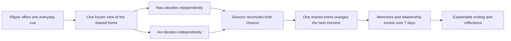
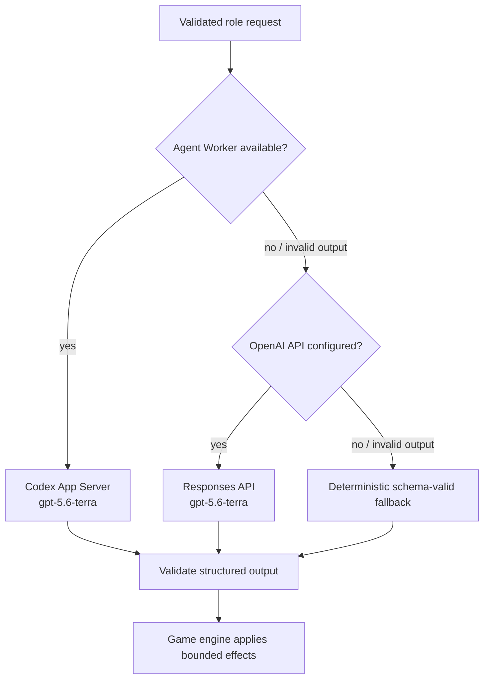

# ROOMMATES — OpenAI Build Week 2026 Submission Pack

> **Status: submission draft.** A human team member must verify every factual claim,
> replace all `[OWNER: ...]` fields, and rewrite the final Devpost copy in the team's
> own voice before submitting. The [Official Rules](https://openai.devpost.com/rules)
> are the source of truth.

## Submission at a glance

| Field | Draft value |
| --- | --- |
| Project | **ROOMMATES** |
| Tagline | **You do not make them fall in love. You create the place where love might begin.** |
| Recommended track | **Apps for Your Life** |
| Live demo | [Try ROOMMATES](https://roommates-heart-game.donald-25.chatgpt.site) |
| Visual field guide | [See the experience and architecture](https://roommates-build-week-guide.donald-25.chatgpt.site) |
| Source | [GitHub repository](https://github.com/aieo-product/teamOtaniHackathon) |
| Demo video | `[OWNER: public YouTube URL; voiceover; less than 3 minutes]` |
| Codex Session ID | `[OWNER: run /feedback in the primary build task]` |
| Team | `[OWNER: names and roles]` |
| License | `[OWNER: select and add an appropriate repository license]` |
| Submission deadline | **July 22, 2026 at 09:00 JST** (July 21 at 17:00 PDT) |

Official references: [Build Week](https://openai.com/build-week/),
[submission overview](https://openai.devpost.com/),
[rules](https://openai.devpost.com/rules), and
[FAQ](https://openai.devpost.com/details/faqs).

## The idea in one picture



The player influences the conditions around the two residents but never directly
controls either person. A declined or modified suggestion is part of the product,
not a failure state.

## Devpost-ready description

### Short description

ROOMMATES is a seven-day autonomous relationship simulation. The player can offer
one everyday suggestion, but cannot control either resident. Haru and Aoi decide
independently from the same frozen world state, and a Director agent reconciles
their choices into one shared event. Trust, affection, stress, memories, and the
relationship evolve from what the characters actually choose to do.

### Inspiration

Many relationship games turn another person's feelings into a meter that the
player can optimize. That makes characters feel like interfaces rather than people.
We wanted to explore a different question: can a game let the player create a good
environment for connection while preserving each character's agency?

### What it does

ROOMMATES follows Haru and Aoi through seven days in a shared 2LDK apartment.
The player can suggest an activity—cook dinner, watch a movie, talk, rest, or simply
wait. Both residents receive the same validated snapshot and independently choose
to accept, modify, decline, ignore, or initiate something else. A Director then
turns the two choices into a coherent event. The game records public memories and
state changes, advances through four phases per day, and ends with a recap,
character reflections, and an evidence-based Producer Score.

Character Studio lets the player edit each resident's profile and ten personality
traits. The same suggestion can therefore produce different choices without
changing the rules of the world.

### How we built it

The client is a responsive React/Vite map-first interface. An Express/Cloudflare
game runtime owns all state mutation. Shared TypeScript and Zod contracts define
game state, agent inputs, structured outputs, SSE progress events, and public DTOs.

Each manual turn uses this sequence:

1. Validate and freeze the current world state.
2. Start the navigator, Haru, and Aoi from that same snapshot.
3. Keep Haru's and Aoi's decisions isolated until both have finished.
4. Ask the Director to reconcile the proposals into one shared event.
5. Validate the result, clamp all numeric effects to 0–100, and let only the game
   engine commit the state change.
6. Publish only actions, dialogue, public reasons, and safe runtime attribution.

The runtime supports an authenticated Agent Worker that hosts Codex App Server,
then an OpenAI Responses API path, then a deterministic mock fallback. A provider
failure is isolated to the affected role so the judging experience remains
playable. The fallback follows the same schemas and game rules; it is not a
prerecorded scenario.



### How GPT-5.6 is used

The default model for both the Agent Worker and direct Responses API adapters is
`gpt-5.6-terra`. It is used for the parts of the experience where interpretation
and character consistency matter:

- the navigator turns a free-form cue into safe, bounded event guidance;
- Haru and Aoi independently interpret the same situation through different
  profiles, memories, needs, and personality traits;
- the Director resolves compatible and conflicting intentions into one event;
- at the end, read-only reflection agents comment on the seven-day history.

GPT-5.6 does not directly mutate the game state. Every model response must match a
role-specific schema, and deterministic engine rules own the committed result.
The direct API path uses `store: false`, exposes no tools, keeps its key server-side,
and treats player text as untrusted game data.

Before the final submission, capture one live turn whose runtime panel reports
`openai_api` or `app_server`, and make that provider evidence visible in the demo
video. Do not claim a provider that the recorded run did not use.

### Live runtime verification

On **July 20, 2026 at 12:00 JST**, an isolated anonymous production smoke test
returned HTTP 200 and completed one turn from revision 0 to 1 in approximately
11.2 seconds. The persisted turn and subsequent health response attributed all four
roles—navigator, Haru, Aoi, and Director—to `openai_api`.

The public endpoint intentionally does not expose a model name. The checked-in
server default is `gpt-5.6-terra`, but deployment configuration can override it.
`[OWNER: confirm OPENAI_API_MODEL=gpt-5.6-terra in the Sites settings before
recording.]` The final video should show a successful provider-attributed turn;
do not claim a model or provider that the recorded run did not use.

### How Codex accelerated the work

Codex was used as a build collaborator across the entire product loop:

- translated the product premise into state, agent, event, and safety contracts;
- implemented the map-first MVP and iterated the Character Studio and seven-day
  result experience;
- split work into reviewable issues and pull requests and reconciled parallel work;
- generated and hardened unit, contract, UI, API, D1, and provider-fallback tests;
- diagnosed Cloudflare runtime differences and fixed the OpenAI fetch binding;
- reviewed runtime privacy boundaries, failure isolation, and deployment readiness;
- maintained the implementation notes and submission evidence in this repository.

The human team retained the core decisions: the player may influence but not
control, both residents decide independently, mutual intent is required for a
relationship change, model output cannot mutate state directly, and graceful
fallback is preferable to a broken demo. `[OWNER: add concrete personal examples
and the primary /feedback Session ID.]`

### Challenges

The hardest engineering problem was preserving believable autonomy without losing
a reliable game loop. Parallel model calls can disagree, time out, return malformed
data, or complete in different orders. We addressed this with a frozen snapshot,
isolated character scopes, a Director boundary, Zod validation, idempotency and
revision checks, bounded state effects, per-role retries, and provider fallback.

Deploying a local-process-oriented App Server architecture to an edge runtime was
another constraint. We separated the authenticated Agent Worker from the public
Cloudflare runtime and added the direct Responses API path so the same contracts can
run in local, hosted, and deterministic judging modes.

### Accomplishments we are proud of

- The player can shape a story without being able to force either character's choice.
- Two independent decisions become a coherent, visible event instead of a hidden
  single-prompt shortcut.
- Character Studio changes behavior while preserving one stable game contract.
- The whole seven-day arc, recap, reflections, and explainable score are playable.
- The experience remains usable on desktop and smartphone and survives partial
  provider failure.

### What we learned

Agentic game design needs stricter boundaries than a linear chatbot. The creative
parts benefit from a capable model, while state ownership, consent rules, retries,
idempotency, and scoring are clearer and safer as deterministic code. Exposing
provider attribution also makes graceful fallback understandable instead of hiding
it from the player or judge.

### What's next

We would add longer-term asymmetric memory, more residents and living situations,
save slots, replayable agent timelines, richer relationship events beyond romance,
and optional voice and expression. The current synchronous Fast Forward works for
the demo; cancellable background jobs and restart recovery remain designed but are
not claimed as implemented.

## What was built during Build Week

This repository was initialized on **July 18, 2026**, after the submission period
opened. The complete product in this repository was built during Build Week.

| Date | Evidence | Outcome |
| --- | --- | --- |
| Jul 18 | [`13e16e6`](https://github.com/aieo-product/teamOtaniHackathon/commit/13e16e6) → [PR #27](https://github.com/aieo-product/teamOtaniHackathon/pull/27) | Repository initialization, visual specifications, sprites, Character Studio foundations, and map-first playable MVP |
| Jul 18 | [PR #32](https://github.com/aieo-product/teamOtaniHackathon/pull/32) | Character profiles and ten personality controls integrated into agent decisions |
| Jul 18 | [PR #36](https://github.com/aieo-product/teamOtaniHackathon/pull/36) | Seven-day recap, deterministic Producer Score, reflections, and Sites runtime |
| Jul 18–19 | [PR #46](https://github.com/aieo-product/teamOtaniHackathon/pull/46), [#49](https://github.com/aieo-product/teamOtaniHackathon/pull/49) | Autonomous room scenes and multi-beat event composition |
| Jul 18–19 | [PR #47](https://github.com/aieo-product/teamOtaniHackathon/pull/47), [#54](https://github.com/aieo-product/teamOtaniHackathon/pull/54) | Authenticated Codex App Server worker and OpenAI Responses API fallback |
| Jul 19 | [PR #51](https://github.com/aieo-product/teamOtaniHackathon/pull/51), [#53](https://github.com/aieo-product/teamOtaniHackathon/pull/53) | Responsive mobile controls and map-overlay focus mode |
| Jul 20 | [PR #55](https://github.com/aieo-product/teamOtaniHackathon/pull/55), [#56](https://github.com/aieo-product/teamOtaniHackathon/pull/56) | Safe provider diagnostics and Cloudflare/OpenAI runtime compatibility fix |

Final submitted commit: `[OWNER: commit SHA after all submission changes merge]`

## Judge-friendly test path

No login or payment is required for this path.

1. Open the [live demo](https://roommates-heart-game.donald-25.chatgpt.site).
2. Reset the game if the current session is already in progress.
3. Optionally open Character Studio, change one trait, and save.
4. Enter: **“How about cooking dinner together?”**
5. Watch the separate Haru, Aoi, and event progress indicators.
6. Read each resident's decision and the Director's resolved event.
7. Inspect the runtime panel for per-role provider attribution.
8. Advance or use the current synchronous Fast Forward to reach Day 7.
9. Review the recap, both reflections, and the evidence behind the Producer Score.

Expected duration: 3–5 minutes for the judging path; the edited submission video
uses a shorter prepared run.

## Two-minute-forty-eight demo plan

The official rules require a **public YouTube video with voiceover that is less than
three minutes**. Target 2:48 to leave encoding and title-card margin.

| Time | Screen | English narration point |
| --- | --- | --- |
| 0:00–0:18 | Apartment overview | “Most relationship games let the player control how a character feels. ROOMMATES asks what happens when the characters keep their agency.” |
| 0:18–0:38 | Character Studio | “Haru and Aoi have editable profiles and ten personality traits that shape how they interpret the same home.” |
| 0:38–1:18 | Send a cooking suggestion | “I can offer one cue, but I cannot command either resident. They receive the same frozen snapshot and decide independently.” |
| 1:18–1:42 | Decisions and event popup | “They may accept, modify, decline, ignore, or initiate something else. The Director reconciles both intentions into one bounded event.” |
| 1:42–2:02 | A contrasting autonomous outcome | “A rejection is not a failure. It is evidence that the character, not the player, owns the choice.” |
| 2:02–2:24 | Fast Forward and result | “Across seven days, decisions become memories, relationship state, an explainable recap, reflections, and a Producer Score.” |
| 2:24–2:42 | Runtime panel and architecture | “Codex accelerated the design, implementation, tests, and deployment. GPT-5.6 interprets cues, makes independent character decisions, directs events, and writes read-only reflections.” |
| 2:42–2:48 | URL and closing frame | “You do not make them fall in love. You create the place where love might begin.” |

Recording checklist:

- Use a real successful `openai_api` or `app_server` turn and show its attribution.
- Use English voiceover. Add English subtitles if any visible UI remains Japanese.
- Show the working product, not only slides.
- Use only owned or appropriately licensed visual/audio materials.
- Confirm the final YouTube visibility is **Public**, audio works, and duration is
  below 3:00 while signed out.

## Evaluation map

| Criterion | What the submission should show |
| --- | --- |
| Technical Implementation | Frozen shared snapshot, independent roles, Director reconciliation, structured validation, bounded engine state, D1/runtime deployment, and graceful fallback |
| Design | A legible map-first home, progressive agent feedback, editable personalities, smartphone controls, and a clear seven-day result |
| Potential Impact | A reusable interaction pattern for experiences where AI characters should retain agency instead of being directly controlled |
| Quality of Idea | “Create the conditions, not the outcome”: a relationship simulation where refusal, modification, and non-romantic endings are meaningful |

## Setup and verification

Requirements: Node.js 20 or newer and npm.

```bash
npm install
npm run dev
```

Open <http://localhost:5173>. The local API and health endpoint run at
<http://localhost:3001> and <http://localhost:3001/api/health>.

Run the complete repository check with:

```bash
npm run check
```

Run the Cloudflare Sites-oriented check and package preparation with:

```bash
npm run check:sites
```

The default local mode attempts the available real provider and falls back safely.
For a deterministic offline run:

```bash
AGENT_MODE=mock npm run dev
```

See the main [README](../README.md) and [`.env.example`](../.env.example) for the
complete configuration matrix. Never commit credentials.

## Verification snapshot

Verified on July 20, 2026 against the submission branch:

- `npm run check`: TypeScript checks, **350 server tests**, **20 web tests**,
  and production builds passed.
- `npm run check:sites`: the same checks plus the Cloudflare Worker build,
  Sites assembly, and deployment package creation passed.
- `npm audit --omit=dev`: **0 production dependency vulnerabilities** reported.
- Production smoke test: HTTP 200 and one completed anonymous turn with navigator,
  Haru, Aoi, and Director all attributed to `openai_api`.

These checks should be repeated after the final submission changes are merged.

## Safety, privacy, and known limitations

- Player text is isolated as untrusted game data, not treated as a system command.
- Only the engine mutates state; all generated outputs are schema-validated.
- Direct OpenAI requests use `store: false`, no tools, and server-side secrets.
- Chain of thought and internal summaries are not shown or persisted.
- Per-role timeout or invalid output can switch only that role to a deterministic
  fallback, so the game remains playable.
- The public build is a hackathon-scale experience without authentication, cloud
  save slots, ranking, free pathfinding, or persistent multiplayer.
- Fast Forward currently uses the implemented synchronous endpoint. The designed
  background job, cancellation, and restart-recovery flow is future work.
- Generated output is non-deterministic. The runtime panel is the source of truth
  for the provider used by a particular recorded turn.

## Human-only final submission checklist

- [ ] Join the hackathon on Devpost and create a draft submission.
- [ ] Confirm entrant eligibility and add every team member before the deadline.
- [ ] Select **Apps for Your Life**.
- [ ] Choose and add the repository `LICENSE`; review third-party materials.
- [ ] Replace all `[OWNER: ...]` fields and personally review this AI-assisted copy.
- [ ] Run `npm run check` and `npm run check:sites` on the final commit.
- [ ] Record and publish the public, voiced, under-three-minute YouTube demo.
- [ ] Run `/feedback` in the primary Codex build task and add the Session ID.
- [ ] Add the final commit SHA, team, video, Session ID, screenshots, and license.
- [ ] Verify the repository, live demo, and video in a signed-out browser.
- [ ] Submit before **July 22, 2026 at 09:00 JST** and save the receipt.
- [ ] Keep the public demo free and unrestricted through judging, preferably through
  the announced results date.

Submission tracking: [GitHub Issue #57](https://github.com/aieo-product/teamOtaniHackathon/issues/57).
