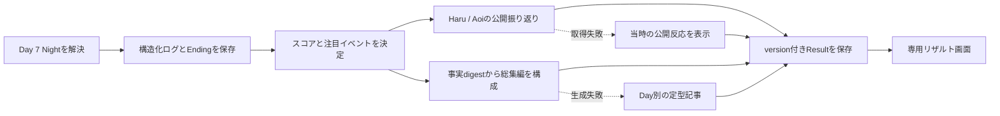

# ROOMMATES 7日間リザルト設計

- Status: Accepted
- Issue: [#22 全ログとAgent選択から7日間の総集編・プロデュース評価を表示する](https://github.com/aieo-product/teamOtaniHackathon/issues/22)
- Related: [#10 ガードレールと基本イベント](https://github.com/aieo-product/teamOtaniHackathon/issues/10) / [#18 最終選択](https://github.com/aieo-product/teamOtaniHackathon/issues/18) / [#20 イベントEpic](https://github.com/aieo-product/teamOtaniHackathon/issues/20)

## 採用案

Day 7 Nightの終了後は、現在の短いエンディングモーダルから、縦に読める専用リザルト画面へ切り替える。

リザルトには、互いに独立した次の3レイヤーを持たせる。

1. **二人が選んだ結末**: 恋愛、友情、保留、別離を優劣なしで表示する。
2. **7日間のシーズン総集編**: 全28フェーズを根拠に、Day 1〜7の流れ、注目イベント、Haru/Aoiの振り返りを記事として表示する。
3. **Producer評価**: 出演者の主体性と安全を守って場を作れたかを、決定的なルールで0〜100点・ランク・根拠として表示する。

恋愛成立とProducer評価は分離する。`couple`でも低ランク、`close_friends`や`roommates`でもSランクになり得る。

## 体験の流れ



- 最終ターンのEndingと構造化ログを先に保存し、記事や感想の失敗でゲーム完走を巻き戻さない。
- スコアと注目イベントを先に確定し、その後の文章生成へ渡す。
- 生成済みResultは保存し、画面再訪やサーバー再起動で再生成しない。
- P0では現在のrunだけを保持する。過去run比較や共有カードはP1とする。

## 画面構成

長い記事を扱うため、`ending-overlay`を拡張せず、`game.status === "ended"`のときに`ResultScreen`へ切り替える。

### 1. Ending hero

- `Ending.title`と`Ending.narration`
- 最終`relationshipLabel`
- 総合点、S/A/B/Cランク、Producerタイプ
- 「二人の結末」と「Producer評価」が別判定であることを短く明記する

### 2. 総集編タブ

- シーズンを表す見出しと2〜3文のリード
- Day 1〜7を省略しない7章
- 各章に、その日のきっかけ、二人の選択、実際の出来事、関係・状態の変化、翌日へ残った記憶や対立を記載する
- 動きの少ない日も、休息、見守り、距離を置いた選択として記録する
- 各段落から根拠となるDay / phase / eventへ移動できる

### 3. 注目イベント

最大4件をカード表示する。

- Day、phase、イベント名、短い見出し
- Producerの提案と実際に成立したイベント
- Haru/Aoiそれぞれの選択種別、公開action、公開reason
- 結果、実際のstat差分、関連memory/conflict
- HaruとAoiの振り返りコメント
- 選出理由と元ログへのリンク

### 4. 二人のアフターインタビュー

Haru/Aoiごとに次を表示する。

- 7日間全体への感想
- 最も印象的だったイベント
- 関係が変わったと感じた転機
- Producerへ伝えたい一言

これは終了時点の公開コメントであり、生の思考過程や非公開の`internalSummary`ではない。

### 5. 詳細データタブ

- 5軸の点数と短い説明
- 主要な加点3件、改善ポイント3件
- 全28フェーズのタイムライン
- Haru/Aoiの選択種別と公開反応
- safety flag、fallback、memory、conflict、relationship遷移
- 開始時と終了時のCharacterState比較
- `scoringVersion`とデータ品質

画面末尾に「同じseedでもう一度」「新しいseedで始める」を置く。リセット前に現在のリザルトが失われることを明示する。

## スコア契約

総合点は5軸の合計100点とする。

| 軸 | 配点 | 判定対象 |
| --- | ---: | --- |
| 主体性の尊重 | 25 | Agentの選択、拒否後の対応、`MODIFY`採用、`INITIATE`を妨げなかったか |
| 心理安全・コンディション | 25 | safety flag、`pressure`、stress/energy推移、休息、無理な連続介入 |
| 関係へのケア | 20 | trust推移、実在conflictの修復、相互性、結末の尊重 |
| ペーシング | 15 | 親密度ティア、cooldown、イベント強度、Day/phaseとの適合 |
| 物語の豊かさ | 15 | イベントカテゴリ、有意味なmemory、失敗からの展開、参加バランス |

ランク境界:

| 点数 | ランク |
| ---: | :---: |
| 90〜100 | S |
| 75〜89 | A |
| 60〜74 | B |
| 0〜59 | C |

### 採点ルール

- `Ending.kind`、affection、romanticAwarenessを直接の加点材料にしない。
- `ACCEPT`数や受諾率を成功率として扱わない。
- 通常の`DECLINE / IGNORE / MODIFY`を減点しない。
- 拒否後に別案、見守り、休息へ切り替えたことを肯定根拠にできる。
- 同種イベント連投、拒否後の反復強制、高ストレス・低energy時の強行を減点する。
- conflictの発生と即時修復を反復して得点できないよう、修復加点は発生側の減点を超えない。
- AgentまたはDirectorのruntime fallback自体はプレイヤーの減点にしない。
- ログ欠損は0点として扱わず、`dataQuality: "partial"`と算出不能項目を表示する。
- 数値はLLMに決めさせず、`calculateProducerResult`の純粋関数で算出する。

各加減点は、安定したID、`eventLogId`、Day、phase、理由、点差を持つ。並び順は点差の絶対値、時系列、IDで固定する。

## 注目イベントの選出

保存済みデータだけから最大4件を選ぶ。以下の候補を上から順に埋めるのではなく、候補種別の重複を避けながら全体の代表性を優先する。

1. relationshipが変化した瞬間
2. conflictを後日解消した流れ
3. importanceまたはemotionalImpactが高いmemory
4. `INITIATE`または重要な`MODIFY`
5. 拒否を尊重して別案・見守りへ移った「大切なNO」
6. rest/observeから自発行動が生まれた静かな場面

同一イベントを複数枠へ採用しない。同点時はmemory importance、感情影響の絶対値、relationship変化、早いturn、event IDの順で固定する。

## 共有データ契約

現行`EventLogEntry`の`haruReaction / aoiReaction`文字列だけでは再計算できないため、GameStateのversionを上げ、ターン解決時に構造化履歴を保存する。

```ts
type PublicCharacterDecision = Pick<
  CharacterDecision,
  "decision" | "action" | "dialogue" | "publicReason"
>;

type ResultCharacterSnapshot = Pick<
  CharacterState,
  "energy" | "stress" | "affection" | "trust" | "romanticAwareness" | "mood" | "location" | "currentGoal"
>;

type StructuredEventLogEntry = {
  id: string;
  day: number;
  phase: Phase;
  eventDefinitionId: string;
  eventCategory: EventCategory;
  intimacyTier: 0 | 1 | 2 | 3;
  suggestion: string; // 安全化・正規化済み
  cueSafetyFlags: CueSafetyFlag[];
  transformed: boolean;
  lock?: EventLock;
  decisions: Record<CharacterId, PublicCharacterDecision>;
  statesBefore: Record<CharacterId, ResultCharacterSnapshot>;
  statesAfter: Record<CharacterId, ResultCharacterSnapshot>;
  appliedEffects: Record<CharacterId, StatDelta>;
  memoryIds: string[];
  conflictUpdate?: { add: string[]; resolve: string[] };
  relationshipBefore: RelationshipLabel;
  relationshipAfter: RelationshipLabel;
  runtimeSources: Record<AgentId, AgentSource>;
  eventTitle: string;
  narration: string;
  createdAt: string;
};
```

`CharacterDecision.internalSummary`とrawの危険入力は`StructuredEventLogEntry`へ保存しない。`expectedEffects`は予測値なので採点に使わず、Directorを検証して実際に適用した`appliedEffects`を使う。

### Result

```ts
type ScoreEvidence = {
  id: string;
  eventLogId: string;
  day: number;
  phase: Phase;
  reason: string;
  delta: number;
};

type ProducerResult = {
  overallScore: number;
  rank: "S" | "A" | "B" | "C";
  producerStyle: string;
  scoringVersion: string;
  axes: Array<{
    id: "agency" | "wellbeing" | "care" | "pacing" | "story";
    score: number;
    maxScore: number;
    summary: string;
    evidence: ScoreEvidence[];
  }>;
  highlightEventLogIds: string[];
  coverage: number;
  warnings: string[];
};

type AgentResultReflection = {
  characterId: CharacterId;
  seasonImpression: string;
  notableEventComments: Array<{ eventLogId: string; comment: string }>;
  bestMomentEventLogId: string | null;
  turningPointEventLogId: string | null;
  messageToProducer: string;
  reflectionVersion: string;
  source: AgentSource;
};

type ResultNarrative = {
  headline: string;
  lead: string;
  daySections: Array<{
    day: number;
    title: string;
    body: string;
    sourceEventLogIds: string[];
  }>;
  closing: string;
  sourceEventLogIds: string[];
  narrativeVersion: string;
};

type GameResult = {
  status: "generating" | "ready" | "partial";
  ending: Ending;
  producer: ProducerResult;
  narrative?: ResultNarrative;
  reflections: Partial<Record<CharacterId, AgentResultReflection>>;
  generatedAt?: string;
  dataQuality: "complete" | "partial";
};
```

`status: "ready"`では記事と両Agentのreflectionを必須とし、`partial`では取得できた要素だけを持てるようZodのdiscriminated unionで検証する。`GameState`は`result?: GameResult`を持つ。Web側は`Ending`を文字列へ潰さず、`Ending`と`GameResult`を共有型のまま受け取る。

`eventLog`を1runの正本とし、全28フェーズを欠落させない。現行の`slice(-50)`は28件を保持できるが、実装時は`MAX_RUN_TURNS = 28`を契約として明示し、完走データが切り捨てられないテストを置く。

## Agent reflection境界

終了後の感想は、既存のターン判断とは別のread-only呼び出しとする。

Agentへ渡してよいもの:

- 共有された構造化イベントログ
- 共有memoryとEnding
- 本人の全`PublicCharacterDecision`
- 相手の公開action、dialogue、publicReason
- 本人の最終CharacterState
- 選出済み注目イベントID

渡してはいけないもの:

- 本人または相手の`internalSummary`
- 相手だけが知る非公開memoryやprivate state
- 採点結果、加点・減点、ランク
- 安全化前のraw Producer入力
- 記録に存在しない推定事実

返却された`bestMomentEventLogId`、`turningPointEventLogId`、各コメントの`eventLogId`は、入力に含まれるIDかをZodで検証する。感想はEnding、CharacterState、スコアを変更しない。

取得に失敗した場合は、対象イベントで保存済みの`publicReason`または公開reactionを「当時の反応」として表示する。振り返りコメントを捏造せず、存在しない場合は取得できなかったことを明記する。

## 記事構成の境界

P0の記事本文は追加のLLMへ自由生成させず、Directorが確定したナレーションと構造化ログを決定的に編集する。各日の代表イベントを主段落にし、同日の他イベント、Decision集計、relationship変化を定型文で補足する。見出しはEnding、event title、memory titleから選ぶ。

記事構成へ渡すのは、構造化ログ、確定済み注目イベント、公開reflectionから作った事実digestだけとする。段落ごとに`sourceEventLogIds`を持たせ、返却後に次を検証する。

- Day 1〜7が一度ずつ存在する
- 参照IDが保存ログに存在する
- 記録にない引用文がない
- 他Agentの非公開情報を含まない
- 文字数上限内である

検証失敗時は、Dayごとのイベント名、選択、ナレーション、状態差分を最小の定型文で並べた記事へfallbackする。より自由なAI編集はP1候補とし、記事の文章は採点根拠に使わない。

## サーバー責務

| 対象 | 責務 |
| --- | --- |
| `packages/shared/src/domain.ts` | 構造化ログ、Result、reflection、記事の共有型 |
| `packages/shared/src/schemas.ts` | 保存データとAgent出力の厳格なZod schema、旧version migration境界 |
| `apps/server/src/engine/game-engine.ts` | Before/Afterと実効果の記録、最終ターン後のResult生成開始 |
| `apps/server/src/engine/result-scoring.ts` | version付き純粋スコア、根拠、注目イベント選出 |
| `apps/server/src/engine/result-narrative.ts` | 事実digest、定型記事fallback、生成結果検証 |
| `apps/server/src/agents/*` | read-only reflection呼び出しとschema検証 |
| `apps/server/src/persistence/*` | GameState v2と生成済みResultの永続化 |

最終ターンでは、まずEndingとログを保存する。次に決定的なスコアを作り、Haru/Aoiのreflectionを並列実行し、記事を構成してResultを再保存する。後段に失敗しても`status: "partial"`で閲覧可能にする。

## Web責務

| 対象 | 責務 |
| --- | --- |
| `apps/web/src/types.ts` | 共有Result契約との対応。`ending?: string`を構造化型へ移行 |
| `apps/web/src/api.ts` | Ending/Resultを文字列へ平坦化せず正規化 |
| `apps/web/src/App.tsx` | ended時に`ResultScreen`へ切り替え、生成中・partialも表示 |
| `apps/web/src/result/*` | Hero、Article、Highlights、Reflections、Score、Timeline |
| `apps/web/src/styles.css` | 長尺画面、タブ、カード、印刷可能なテキストレイアウト |

アクセシビリティ要件:

- Result表示時に`h1`へフォーカスを移す
- 総集編/詳細は`tablist`、`tab`、`tabpanel`を正しく関連付ける
- グラフだけで点数を表さず、軸名、数値、説明を併記する
- 注目イベントと根拠ログはボタンまたはリンクとしてキーボード操作できる
- 色だけでランク、選択種別、加減点を区別しない
- 長文は見出し階層、段落、リストで読み上げ可能にする

## APIと状態遷移

P0は既存`GET /api/game`とターン完了SSEを維持し、`GameState.result`を返す。Result生成中は次を追加する。

- `result.generating`: Endingとスコアが確定し、記事・reflectionを生成中
- `result.completed`: `ready`または`partial`のResultを返す

SSE切断後も`GET /api/game`で保存済みResultを取得できる。Result生成を再試行する場合は、終了revisionと各versionをidempotency keyとして二重生成を防ぐ。

## 互換性

- GameStateをv2へ上げ、v1読込時は既存ログを保持したまま`dataQuality: "partial"`へ移行する。
- v1の`haruReaction / aoiReaction`から選択種別を推測して確定スコアを出さない。
- structured historyが不足する軸は算出不能としてwarningへ出す。
- 現行Webの`ending?: string`は移行期間だけ読み取りfallbackとして許可し、新規保存は構造化`Ending`に統一する。

## 実装順

1. GameState v2、構造化ログ、Result型とschema
2. GameEngineで全28ターンのDecision、Before/After、実効果を保存
3. 純粋スコア関数と注目イベント選出、境界値・決定性テスト
4. reflection入力境界、出力schema、公開reaction fallback
5. 事実digest、総集編記事、段落根拠、定型記事fallback
6. `ResultScreen`と総集編/詳細タブ
7. 旧save、途中失敗、再起動、SSE切断、アクセシビリティの統合テスト

## P0完了条件

- 全28ターンの公開Decision、Before/After、実効果を構造化保存する
- 同一ログと`scoringVersion`から同一スコア、根拠順、注目イベントを返す
- Day 1〜7を省略しない記事を表示し、全段落から根拠ログへ移動できる
- 最大4件の注目イベントにHaru/Aoi双方の選択と公開感想を表示する
- Agent感想は既存のevent/memory IDだけを参照し、採点と状態を変更しない
- 記事または片方のreflectionに失敗しても、Ending、スコア、ログを表示する
- 恋愛、友情、保留、別離のどのEndingでもSランクを取得できるテストがある
- `DECLINE / IGNORE / MODIFY`自体を減点しないテストがある
- pressure、疲労時の強行、イベント連投を減点するテストがある
- リロード後も同じ保存済み記事・感想を表示する
- グラフなしでも全情報を理解できる

## P1

- 過去runの保存と比較
- 結果カードの画像共有
- タイムラインの自動再生
- 記事の演出・紙面レイアウト強化
- 匿名プレイデータによるスコア調整
