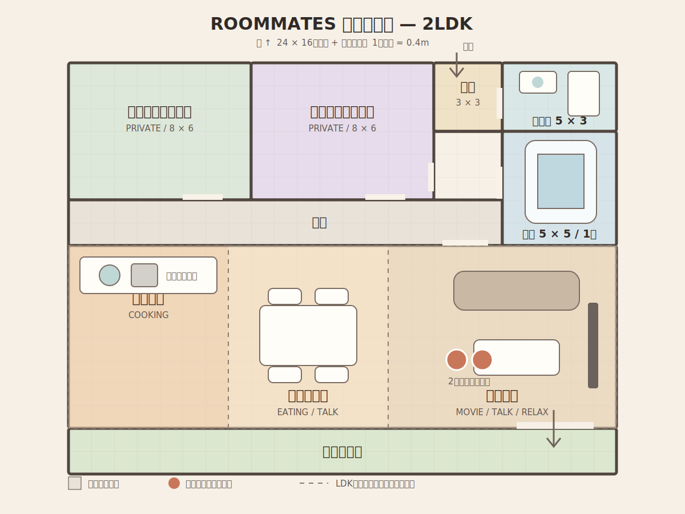
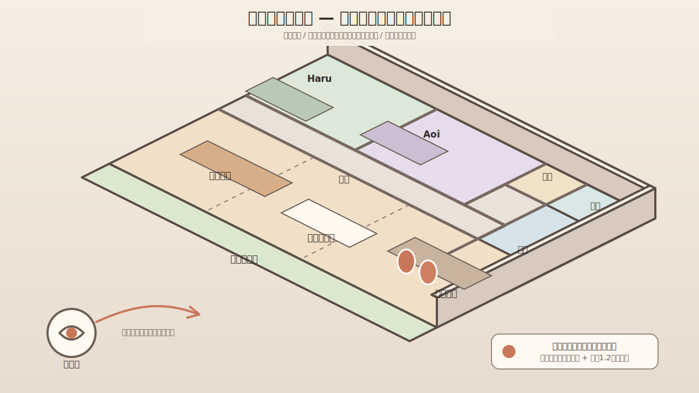
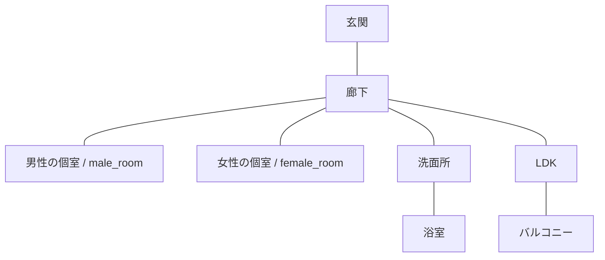

# ROOMMATES 基本間取り仕様

Issue: [#7 動的な部屋生成に使用する基本間取りを決定する](https://github.com/aieo-product/roommates-autonomous-life-sim/issues/7)

## 採用案

ROOMMATES の住居は、**共用部を南側、個室を北側にまとめた 2LDK** とする。

- 室内グリッド: 24 × 16 タイル
- バルコニー: 24 × 2 タイル
- 1タイル: 0.4 m（ゲーム内の論理寸法）
- 室内の概算面積: 61.44 m²（壁を含む）。有効面積は約55 m²
- 北を画面上、南を画面下とする
- 廊下を介して個室と水回りを分離し、LDKを2人の生活の中心にする
- キッチン、浴室、窓、扉など、生成後に位置が変わると不自然な設備は固定する

ゲーム画面での構図は、平面図をそのまま真上から映すのではなく、住居全体を斜め上から覗くカットアウェイ表示とする。

## 設計意図

1. **共有シーンを作りやすい**
   LDKを横長の一室とし、料理、食事、映画、会話などを同じ背景のゾーン差分で表現できる。
2. **プライベート空間を守れる**
   男性側・女性側の個室は廊下から入る。現在の既定住人ではHaruを`male_room`、Aoiを`female_room`へ割り当てる。
3. **背景生成の一貫性を保てる**
   給排水、開口部、主要動線、カメラ方向を固定し、家具・小物・光・天候だけを変化させる。
4. **2人を同時に配置できる**
   LDKの各ゾーンに2人分の立ち位置と移動余白を確保する。浴室は例外として1人専用とする。

## 部屋と用途

| ID | 表示名 | 区分 | 主な用途 | 同時配置 |
| --- | --- | --- | --- | --- |
| `male_room` | 男性の個室 | プライベート | 睡眠、仕事、趣味、一人で休む | 原則1人、イベント時2人 |
| `female_room` | 女性の個室 | プライベート | 睡眠、読書、身支度、一人で休む | 原則1人、イベント時2人 |
| `entry` | 玄関 | セミプライベート | 帰宅、外出、来客、荷物 | 2人 |
| `hallway` | 廊下 | セミプライベート | 各室間の移動、短い遭遇 | 2人 |
| `washroom` | 洗面所 | プライベート | 洗面、洗濯、身支度 | 原則1人 |
| `bathroom` | 浴室 | プライベート | 入浴 | 1人 |
| `kitchen` | キッチン | 共有 | 調理、片付け | 2人 |
| `dining` | ダイニング | 共有 | 食事、作業、ボードゲーム | 2人 |
| `living` | リビング | 共有 | 会話、映画、ゲーム、くつろぎ | 2人 |
| `balcony` | バルコニー | 共有 | 洗濯、植物、夕涼み | 2人 |

`kitchen`、`dining`、`living` は、一続きの `ldk` に属するゾーンとして扱う。ゲーム画面は常に住居全体を表示し、各部屋・ゾーンはイベント時のフォーカス対象になる。

### 個室IDの互換性

保存・export・新規生成では`male_room`と`female_room`だけを使用する。旧データの読み込み時に限り、次のaliasを正規化してからroom参照、家具配置、フォーカス判定へ渡す。

| 読み込み専用ID | 正規化後 |
| --- | --- |
| `haru_room` | `male_room` |
| `aoi_room` | `female_room` |
| `famale_room` | `female_room` |

`famale_room`は過去入力の綴り誤りに対する互換値であり、公開APIや新規manifestへ出力しない。`haru_bed`など既存asset/anchor IDは部屋IDとは別の識別子なので、この移行では変更しない。

## 接続関係

移動可能な接続は次の通り。記載のない部屋同士は直接移動できない。

動線上のルール:

- 外部との出入りは玄関のみ。
- 浴室へは洗面所を経由する。
- バルコニーへはLDKを経由する。
- 個室同士を直接接続しない。
- LDK内の3ゾーン間は扉なしで移動できる。

## シチュエーション対応表

| シチュエーション | 表示範囲 | フォーカスするゾーン／部屋 | 代表的な可変演出 |
| --- | --- | --- | --- |
| 一緒に料理する | 住居全体 | `kitchen` | 食材、調理器具、湯気、照明 |
| 食事をする | 住居全体 | `dining` | 料理、食器、椅子の向き |
| 映画を見る | 住居全体 | `living` | 画面の光、飲み物、夜間照明 |
| 2人で会話する | 住居全体 | `living` または `dining` | 表情、小物、座る位置 |
| 1人で休む | 住居全体 | 各キャラクターの個室 | 本、端末、寝具、時間帯 |
| 仕事／勉強をする | 住居全体 | 各個室のデスク | PC、ノート、手元照明 |
| 朝の身支度 | 住居全体 | 洗面台 | タオル、化粧品、朝の光 |
| 帰宅／外出する | 住居全体 | 玄関 | 靴、荷物、天候表現 |
| 洗濯物を干す | 住居全体 | バルコニーの物干し側 | 洗濯物、風、天候 |
| 夕涼みをする | 住居全体 | バルコニーの手すり側 | 空の色、植物、飲み物 |
| 廊下ですれ違う | 住居全体 | 個室前の廊下 | 時間帯、短い台詞演出 |

同じシチュエーションで複数候補がある場合は、関係性、時間帯、直前の行動を使って選択する。指定がなければ共有イベントは `living`、個人イベントは本人の個室を既定値とする。

## 2Dゲーム画面の見せ方

- **視点**: 住居全体を南西側の斜め上から覗く、屋根を外したカットアウェイ表示。奥行きの歪みを抑えるため、等角投影に近い平行投影を使う。
- **表示範囲**: 玄関からバルコニーまで住居全体を常に1画面内へ収める。部屋ごとの背景切り替えは行わない。
- **向き**: 北側を画面奥、南側を画面手前に固定する。構図を左右反転しない。
- **壁の扱い**: 北側と東側の壁は通常高さで描き、視界を遮る南側と西側の外壁は非表示または腰壁の高さにする。内壁はキャラクターを隠さない高さに抑える。
- **基準画面**: 16:9、1280 × 720 px。レスポンシブ時も16:9のゲーム領域を維持し、UIは安全領域へ配置する。
- **描画単位**: 1タイルを基準に背景とキャラクターの位置を決める。実ピクセルへの換算はレンダラー側で行う。
- **イベントの強調**: 通常時の全体構図を維持したまま、対象の部屋へ最大1.2倍まで滑らかにズームし、照明・彩度・アウトラインでフォーカスを示す。イベント終了後は全体表示へ戻す。
- **非対象エリア**: 消去せず、明度または彩度を少し下げる。別室のキャラクターや生活変化も同じ画面で把握できる状態を保つ。
- **キャラクター余白**: 1人につき最低2 × 2タイルの配置領域を持たせ、2人の中心点は最低2タイル離す。
- **通路幅**: 主要動線は最低2タイルを確保し、動的な家具で塞がない。

## 固定要素と変更可能要素

### 常に固定する

- 部屋の外形、床の段差、壁
- 扉、窓、バルコニー開口部
- 玄関の上がり框
- 給排水接続領域（既定packでは1×2の対面アイランドキッチン）
- 洗面台、洗濯機置き場、浴槽
- 各部屋を結ぶ主要動線
- カメラの向きとキャラクターの基準スケール
- 住居全体が収まる既定カメラ位置と最大ズーム率
- 部屋ごとの出入口アンカー、キャラクター配置禁止領域

### アンカー内で変更できる

- ソファ、ローテーブル、ダイニングテーブル、椅子
- 個室のベッド、デスク、収納の外観
- テレビ、照明、カーテン、ラグ
- 植物、食器、本、端末、写真などの小物
- 壁紙、床材、家具の色。ただし部屋IDと衝突しないパレットを使う

### シーンごとに自由に変更できる

- 時間帯、天候、窓外、室内光
- 食事、洗濯物、作業道具などの一時的な小物
- キャラクターの位置、向き、表情、ポーズ
- パーティクル、湯気、画面光などの演出

## 生成時の制約

1. 固定設備と `blocked` 領域へ家具やキャラクターを置かない。
2. `door_clearance` と主要通路を常に空ける。
3. 2人シーンでは `pair` タグを持つ配置アンカーを1組以上使う。
4. 家具の外観は変えてよいが、アンカーの最大寸法を超えない。
5. 背景生成後も、部屋ID、出入口、北向き、全体カットアウェイ構図、キャラクター基準スケールを維持する。
6. 浴室は1人用とし、2人の同時配置候補から除外する。
7. 生成に失敗した場合は、各シーンの既定プリセットへフォールバックする。

## 実装参照

生成処理へ渡す概略データは [`room-layout.json`](./room-layout.json) に記録する。座標は左上を原点とするタイル座標で、`x` は右方向、`y` は下方向へ増加する。

データ利用側は次を固定契約として扱う。

- `id`: 保存データやシナリオから参照する安定ID
- `bounds`: 住居全体における部屋／ゾーンの範囲
- `connections`: 通行可能な接続
- `anchors`: 家具、キャラクター、演出を置ける基準領域
- `blocked`: 固定設備や通行確保のため配置できない領域
- `situationMappings`: シチュエーションから表示シーンへの既定マッピング

家具素材の配置は [`../assets/furniture/manifest.json`](../assets/furniture/manifest.json) の `floorContact` と整数 `footprintTiles` を使う。占有矩形は `[x - width, x) × [y - depth, y)` で、PNGの`render.pivot`を投影後の接地点へ合わせる。SVGピクセル座標や絶対表示倍率は保存しない。既定packではキャラクター=1×1、冷蔵庫=1×1、アイランドキッチンと浴槽=1×2とし、Assets管理画面で画像・規格・配置を変更しても同じ契約で描画と移動衝突を解決する。
